# FlexForms Web

Multi-tenant Razor Pages frontend for **FlexForms** — a SaaS form platform that turns JSON templates into GOV.UK task-list applications.

Each tenant (Transfers, Visits, LSRP, …) is resolved from hostname or `X-Tenant-ID`. Configuration is loaded from **flexforms-api** TenantConfig (not from per-product folders). Persistence and business rules live in the API; this repo owns UI, auth cookies, form orchestration, and admin tools.

Template authoring guide: [`docs/Form-Template-Designer-Manual.md`](docs/Form-Template-Designer-Manual.md).

---

## Features

- **Platform bootstrap** — Host config from API at startup; per-request tenant config for Target `Web`
- **Template-driven form engine** — Tasks, pages, fields, conditional logic, collection & derived flows
- **Auth** — DfE Sign-In (OIDC) and optional Entra SSO, with cookie sessions and API token exchange
- **Shared Data Protection** — Azure Blob + Key Vault key ring so session cookies work across replicas
- **Admin area** — Template Manager, User Manager, Role Manager, Event mappings (Admin), Tenant Settings (including email placeholder mappings)
- **Contributors** — Invite collaborators when `contributorPattern` is enabled on the template
- **Files** — Upload via API; ClamAV scan results from Service Bus; optional tenant file-validation status
- **Notifications** — API-backed notification centre + SignalR (malware, file delete, file validation)
- **Emails** — Confirmation / invite personalisation is API-owned (GOV.UK Notify); Web configures optional `EmailPlaceholderMappings` via Tenant Settings
- **GOV.UK Frontend** — Design System components via GovUk.Frontend.AspNetCore
- **Request tracing** — Correlation id end-to-end, structured logs (Serilog → Application Insights), API error logging with ErrorId

---

## Architecture overview

This repository follows **Clean Architecture**. Dependencies point inward: Domain has no external dependencies, Application depends only on Domain, and Infrastructure implements Application ports. The Web layer is a thin composition root and UI host.

| Layer | Project | Depends on | Purpose |
|-------|---------|------------|---------|
| **Domain** | `GovUK.Dfe.FlexForms.Domain` | — | `FormTemplate` models, `FormRouteParser`, `FormStepPolicy`, `CheckboxValueNormalizer` |
| **Application** | `GovUK.Dfe.FlexForms.Application` | Domain | Use-case services, port interfaces, work-state bags, outcome types, `AdminApiErrorMapper` |
| **Infrastructure** | `GovUK.Dfe.FlexForms.Infrastructure` | Application | Adapter implementations (API clients, session stores, Redis, MassTransit consumers) |
| **Web** | `GovUK.Dfe.FlexForms.Web` | Application, Infrastructure | Razor Pages (thin PageModels), middleware, auth, DI composition root |

### Dependency rule

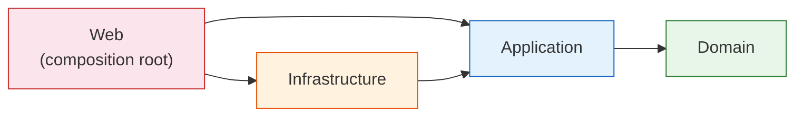

These boundaries are enforced at build time by **NetArchTest guard tests** (`Architecture/CleanArchitectureGuardTests.cs`):

- PageModels must not reference `GovUK.Dfe.FlexForms.Infrastructure`
- Application must not reference Infrastructure or Web
- Application must not take `ISession`, `ModelStateDictionary`, or `HttpContext`
- Domain must not reference any outer layer

### System context

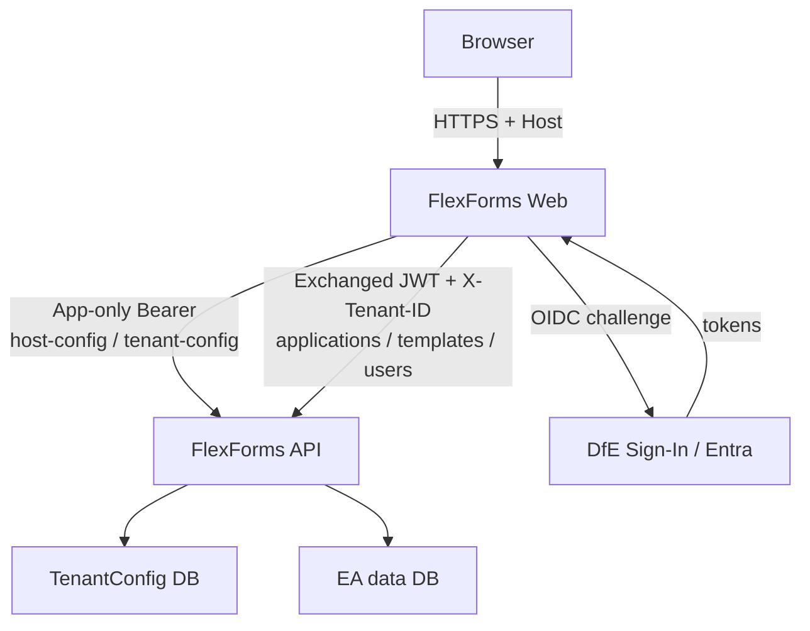

---

## Multi-tenant bootstrap and request flow

### Startup (platform host config)

`PlatformBootstrap:Enabled` must be `true`. On start:

1. Load `appsettings.bootstrap.json` + environment + user secrets.
2. Acquire an **app-only Entra token** (`PlatformAccessTokenProvider`).
3. Call `GET /v1/host-config?target=Web`.
4. Merge host keys into `IConfiguration`.

Legacy `configurations/{APPLICATION_NAME}/` folders are **not** used.

### Per request (tenant)

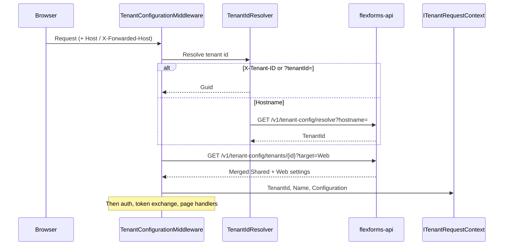

**Tenant id order** (`TenantIdResolver`):

1. Header `X-Tenant-ID`
2. Query `tenantId`
3. Public hostname (`X-Forwarded-Host` → `Request.Host`) → API resolve

Prefer launch profiles that use `*.localhost` hostnames mapped in TenantConfig (e.g. `lsrp.localhost`, `rgvisits.localhost`).

**API business calls** get `X-Tenant-ID` from `TenantApiClientSettingsProvider` / Api.Client `HeaderForwardingHandler`.

---

## Observability and request tracing

Structured logging uses **Serilog** with `Enrich.FromLogContext()` and an Application Insights sink (`ExceptionTrackingTelemetryConverter`). Disable the default App Insights `ILogger` provider so all telemetry flows through Serilog.

### Correlation id

- Header: `x-correlationId` (GUID) on every browser request and outbound API call.
- Middleware: CoreLibs `UseCorrelationId()` (replaces the former local middleware).
- Log scope key: `CorrelationId` (canonical name for App Insights `customDimensions`).

### Request telemetry scopes

After auth and template selection, `RequestTelemetryEnrichmentMiddleware` populates:

| Property | Source |
|----------|--------|
| `CorrelationId` | CoreLibs correlation middleware |
| `TenantId`, `TenantName` | `ITenantRequestContext` |
| `UserId`, `UserEmail` | Authenticated claims |
| `TemplateId`, `ApplicationReference` | Session (when configured) |
| `ServiceName` | `flexforms-web` |

FlexForms-specific keys live in `Telemetry/FlexFormsLogContextKeys.cs` and `IFlexFormsRequestScope` — not in the shared CoreLibs NuGet.

### Outbound API headers

`CorrelationIdForwardingHandler` (global `HttpClient` default) forwards:

- `x-correlationId`
- `X-Template-Id` / `X-Application-Reference` when session is available (skipped during early tenant bootstrap before `UseSession()`)

Api.Client `HeaderForwardingHandler` also forwards tenant and auth headers on typed API clients.

### API error logging

`ExternalApiPageExceptionFilter` and `ExternalApiMvcExceptionFilter` log every API failure with `ErrorId`, `StatusCode`, `CorrelationId`, `TenantId`, `UserEmail`, `TemplateId`, and path — then redirect or return the appropriate UX. The user-facing error page can show the API `ErrorId` from TempData.

`TokenExchangeHandler` logs exchange failures (no silent catches).

### Support queries (Application Insights)

End-user provides **ErrorId** from the error page → search traces/exceptions by `customDimensions.ErrorId` → follow `customDimensions.CorrelationId` for the full Web + API chain.

Example:

```kusto
union traces, exceptions
| where customDimensions.ErrorId == "P-123456"
| project timestamp, cloud_RoleName, message,
          customDimensions.CorrelationId, customDimensions.TenantId,
          customDimensions.UserEmail, customDimensions.TemplateId
| order by timestamp asc
```

Generic CoreLibs keys and more KQL examples: `DfE.CoreLibs.Http/ExceptionHandler.md`.

---

## Authentication

### Scheme selection

`DynamicAuthenticationSchemeProvider` / composite strategy (priority):

1. Internal service headers (`x-service-email` + API key)
2. Test authentication (when enabled)
3. **Entra SSO** when tenant `EntraSso:Enabled`
4. Else **DfE Sign-In OIDC**

Cookies are the authenticate / sign-in / sign-out scheme. Challenge uses Entra or OpenIdConnect.

### DfE Sign-In

- Registered via CoreLibs custom OIDC.
- Per-request overlay: `TenantAwareOpenIdConnectConfigurator` (ClientId, authority, redirects from tenant settings).
- Callbacks: `/signin-oidc`, `/signout-callback-oidc`.

### Entra SSO

- Always registered; activated when tenant enables it.
- Overlay: `TenantAwareEntraSsoConfigurator`.
- Callbacks: `/signin-entra`, `/signout-callback-entra`.

### Token exchange and refresh

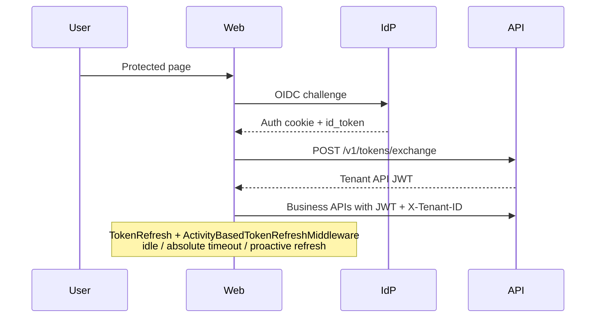

- `ExternalApplicationsApiClient:RequestTokenExchange` is forced on when platform bootstrap is enabled.
- Session tickets use distributed cache ticket store.
- `TokenRefresh` settings (tenant-aware): refresh lead time, force logout window, inactivity and absolute timeouts.
- Stay-signed-in: `SessionController` + antiforgery.

### Roles in the UI

| Role / claim | Capabilities |
|--------------|--------------|
| **SuperAdmin** | All admin + **Tenant Settings**; can assign tenant Admin |
| **Admin** | Template / User / Role managers within tenant |
| **Custom Manage claims** | e.g. `Template:Any:Manage`, `User:Any:Manage` open Admin hub / tools |
| **User** | Applications, form fill, contributors (if enabled) |

See `Security/AdminAccessHelper.cs`.

---

## Clean Architecture pattern (use cases)

Every page in the application follows the same pattern. Business logic lives in the **Application** layer as a use-case service. The **PageModel** is a thin dispatcher that binds HTTP, calls the use case, and maps the result to `Page()` / `Redirect()` / `File()`.

### Pattern overview (how a request flows through the layers)

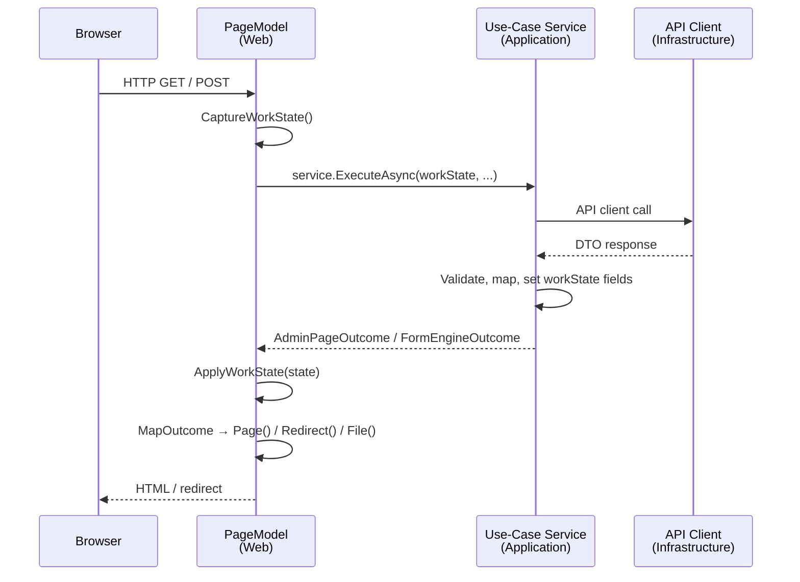

### What lives where

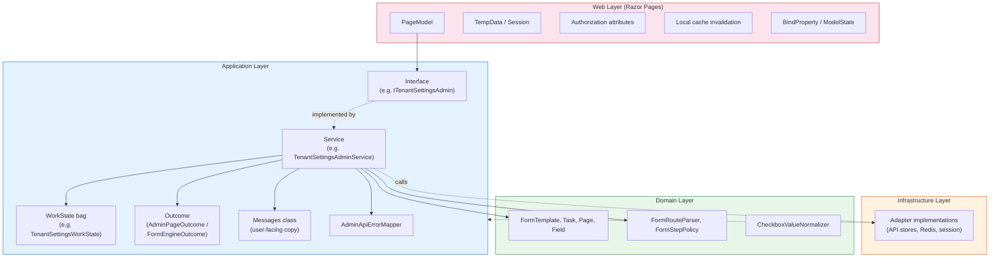

### The four artefacts per feature

Every feature (Admin page, form engine handler, dashboard) produces up to four files in `Application/`:

| Artefact | Example | Purpose |
|----------|---------|---------|
| **Interface** | `ITenantSettingsAdmin` | Port the PageModel depends on |
| **Service** | `TenantSettingsAdminService` | Implements the interface; calls API clients, applies business rules |
| **WorkState** | `TenantSettingsWorkState` | Mutable bag of view-state. PageModel populates it before the call (`CaptureWorkState`), the service mutates it, PageModel reads it back (`ApplyWorkState`) |
| **Messages** | `TenantSettingsMessages` | `const string` user-facing copy (error/success text). Keeps strings identical to the original PageModel for backward compatibility |

Shared helpers:

| Helper | Location | Purpose |
|--------|----------|---------|
| `AdminPageOutcome` | `Application/Admin/` | HTTP-agnostic result: `Stay`, `Redirect`, or `File` with optional success/error messages and cache-refresh flag |
| `FormEngineOutcome` | `Application/FormEngine/` | Same idea for form engine: redirect URL, validation errors, file downloads, notification context |
| `AdminApiErrorMapper` | `Application/Admin/` | Maps `ExternalApplicationsException` to user-friendly messages; optional WAF/gateway hint |

### What stays on the PageModel

The PageModel remains responsible for HTTP concerns that cannot cross into Application:

- `[Authorize]` policies and `[BindProperty]` attributes
- `TempData` read/write (PRG pattern)
- Tenant resolution (`ITenantRequestContext`)
- Local cache invalidation (`ITenantConfigurationCache`, `ITenantIdResolver`)
- `ModelState` manipulation and `Page()` / `RedirectToPage()` / `File()` return
- Session reads for presentation (e.g. `FormSessionKeys`)
- `HttpContext.User` claims extraction (passed as values into the use case)

### PageModel lifecycle (step by step)

```csharp
// 1. Capture current state into a work-state bag
var state = CaptureWorkState();

// 2. Call the Application use case
var outcome = await tenantSettingsAdmin.UpdateAsync(
    state, category, target, settingsJson, isSecret, cancellationToken);

// 3. Copy mutated state back to PageModel properties
ApplyWorkState(state);

// 4. Map the outcome to an HTTP result
return MapOutcome(outcome);
```

### Concrete example: Tenant Settings

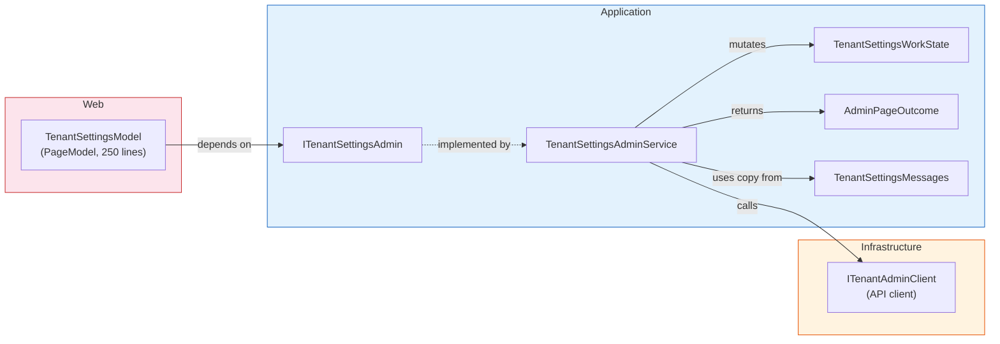

### Project folder structure

```
src/
├── GovUK.Dfe.FlexForms.Domain/
│   ├── Models/              # FormTemplate, Task, Page, Field, ...
│   └── FormEngine/          # FormRouteParser, FormStepPolicy, CheckboxValueNormalizer
│
├── GovUK.Dfe.FlexForms.Application/
│   ├── Interfaces/          # Ports: IFormSessionStore, IApplicationResponseService, ...
│   ├── Admin/               # Admin use cases (one interface + service + workstate + messages per page)
│   │   ├── ITenantSettingsAdmin + TenantSettingsAdminService
│   │   ├── IUserManagerAdmin + UserManagerAdminService
│   │   ├── IRoleManagerAdmin + RoleManagerAdminService
│   │   ├── IDuplicateTenantAdmin + DuplicateTenantAdminService
│   │   ├── IOrganisationSettingsAdmin + OrganisationSettingsAdminService
│   │   ├── IAdminHome + AdminHomeService
│   │   ├── ... (EventMappings, TemplateManager, CustomStatusLabels, ContributorManagement)
│   │   ├── AdminPageOutcome              # shared outcome type
│   │   ├── AdminApiErrorMapper           # shared error formatting
│   │   └── AdminSettingsEncoding         # Base64 helper
│   ├── Dashboard/           # IDashboardApplications, DashboardColumnResolver, DashboardAnswerReader
│   ├── FormEngine/          # Form engine use cases
│   │   ├── IPrepareFormEngineGet + PrepareFormEngineGetService
│   │   ├── ISaveFormPage + SaveFormPageService
│   │   ├── ICompleteFormTask + CompleteFormTaskService
│   │   ├── ISubmitFormApplication + SubmitFormApplicationService
│   │   ├── IUploadFormFile / IDeleteFormFile / IDownloadFormFile
│   │   ├── IRemoveCollectionItem + RemoveCollectionItemService
│   │   ├── FormEngineOutcome / FormEngineWorkState
│   │   └── FormFileFieldService, InfectedUploadFilter, ...
│   └── Validation/          # FormValidationResult, FormValidationError
│
├── GovUK.Dfe.FlexForms.Infrastructure/
│   ├── DependencyInjection.cs   # AddInfrastructureDependencyGroup() — all adapter registrations
│   ├── Services/            # ApplicationResponseService, FormStateManager, ConditionalLogicEngine, ...
│   ├── Stores/              # HttpFormSessionStore, RedisInfectedFileStore, ApiTemplateStore
│   ├── Parsers/             # JsonFormTemplateParser
│   ├── Providers/           # FormTemplateProvider, SchemaEventDefinitionProvider
│   ├── Consumers/           # ScanResultConsumer (MassTransit)
│   └── Messaging/           # MessagingEventBusConfigurator
│
├── GovUK.Dfe.FlexForms.Web/
│   ├── Pages/
│   │   ├── FormEngine/      # RenderForm (partial class, ~340+300 lines), BaseFormEngineModel (~80 lines)
│   │   ├── Admin/           # Thin PageModels: TenantSettings (250), UserManager (83), RoleManager (124), ...
│   │   ├── Applications/    # Dashboard (280), Index, Contributors, ...
│   │   └── Shared/          # BaseFormPageModel
│   ├── Extensions/
│   │   └── ServiceCollectionExtensions.cs  # AddWebLayerServices() → calls AddInfrastructureDependencyGroup()
│   ├── Program.cs           # Composition root (auth, middleware, MassTransit)
│   └── ...
│
└── Tests/
    ├── GovUK.Dfe.FlexForms.Domain.Tests/           # 43 tests
    ├── GovUK.Dfe.FlexForms.Application.Tests/      # 100 tests (Admin + FormEngine use cases)
    ├── GovUK.Dfe.FlexForms.Infrastructure.UnitTests/ # 64 tests
    └── GovUK.Dfe.FlexForms.Web.UnitTests/          # 228 tests (incl. architecture guard tests)
```

### DI wiring

All Infrastructure adapters are registered in one place:

```
Infrastructure/DependencyInjection.cs  →  AddInfrastructureDependencyGroup()
```

The Web composition root calls it via:

```
Web/Extensions/ServiceCollectionExtensions.cs  →  AddWebLayerServices()
    ↳ services.AddInfrastructureDependencyGroup()   // Infrastructure adapters
    ↳ services.AddScoped<ITenantSettingsAdmin, ...>  // Application use cases
    ↳ services.AddScoped<IFieldRendererService, ...> // Web-only services
```

`Program.cs` calls `AddWebLayerServices()` once. It no longer duplicates Infrastructure registrations.

### Adding a new Admin page (recipe)

1. Create in `Application/Admin/`:
   - `IMyFeatureAdmin` (interface with XML docs)
   - `MyFeatureAdminService` (sealed, primary constructor)
   - `MyFeatureWorkState` (mutable bag)
   - `MyFeatureMessages` (const strings)
2. Register in `ServiceCollectionExtensions.AddWebLayerServices()`
3. Thin the PageModel:
   - Constructor takes `IMyFeatureAdmin` (not API clients)
   - `CaptureWorkState()` → use case → `ApplyWorkState()` → `MapOutcome()`
   - Keep authorization, TempData, cache invalidation on the PageModel
4. Add tests in `Application.Tests/Admin/` (validation failures + happy path)

---

## Form engine

### Domain model

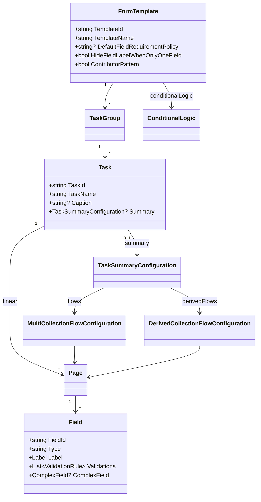

Full authoring reference: [`docs/Form-Template-Designer-Manual.md`](docs/Form-Template-Designer-Manual.md).

### Runtime flow

| Concern | Use case (Application) | Infrastructure adapter |
|---------|------------------------|----------------------|
| Entry / page load | `IPrepareFormEngineGet` | `IFormStateManager`, `IFormNavigationService`, `IFormTemplateProvider` |
| Save answers | `ISaveFormPage` | `IApplicationResponseService`, `IFormValidationOrchestrator` |
| Complete task | `ICompleteFormTask` | `IApplicationResponseService` |
| Submit application | `ISubmitFormApplication` | `IApplicationsClient` |
| Upload file | `IUploadFormFile` | `IFileUploadService` |
| Delete file | `IDeleteFormFile` | `IFileUploadService`, `IInfectedFileStore` |
| Download file | `IDownloadFormFile` | `IApplicationsClient` |
| Remove collection item | `IRemoveCollectionItem` | `IFormSessionStore` |
| Conditional logic | `FormEngineConditionalLogic` | `IConditionalLogicEngine` / `IConditionalLogicOrchestrator` |
| Complex fields | — | `IComplexFieldConfigurationService`, `IComplexFieldRendererFactory` |
| File validation gate | — | `GetFileValidationGateAsync` blocks preview submit when the API gate says so |

### Template selection

`TemplateSelectionMiddleware`:

- Multiple live templates → `/templates?liveOnly=true`
- Single live → auto-select
- Admins can preview non-live templates

---

## Admin area

Hub: `/admin` (`CanAccessAdminArea`). Each admin page follows the [Clean Architecture use-case pattern](#clean-architecture-pattern-use-cases) described above.

| Tool | Route | Who | Application use case |
|------|-------|-----|---------------------|
| Admin Home | `/admin` | Admin / SuperAdmin | `IAdminHome` |
| Template Manager | `/admin/template-manager` | Admin / SuperAdmin / Template Manage | `ITemplateManagerAdmin` |
| Create Template | `/admin/create-template` | Same | `ITemplateManagerAdmin` |
| Custom status labels | `/admin/custom-status-label-overrides` | Same | `ICustomStatusLabelOverridesAdmin` |
| User Manager | `/admin/user-manager` | Admin / SuperAdmin / User Manage | `IUserManagerAdmin` |
| Add User | `/admin/user-manager-add` | Same | `IUserManagerAddAdmin` |
| Edit User | `/admin/user-manager-edit` | Same | `IUserManagerEditAdmin` |
| User Permissions | `/admin/user-manager-permissions` | Same | `IUserManagerPermissionsAdmin` |
| Role Manager | `/admin/role-manager` | Admin / SuperAdmin | `IRoleManagerAdmin` |
| Role Permissions | `/admin/role-manager-permissions` | Same | `IRoleManagerPermissionsAdmin` |
| Organisation Settings | `/admin/organisation-settings` | Admin / SuperAdmin | `IOrganisationSettingsAdmin` |
| Contributor Management | `/admin/contributor-management` | Admin / SuperAdmin | `IContributorManagementAdmin` |
| Duplicate Tenant | `/admin/duplicate-tenant` | **SuperAdmin only** | `IDuplicateTenantAdmin` |
| Tenant Settings | `/admin/tenant-settings` | **SuperAdmin only** | `ITenantSettingsAdmin` |
| Event Mappings | `/admin/event-mappings` | Admin / SuperAdmin | `IEventMappingsAdmin` |

All admin use cases return `AdminPageOutcome` and use `AdminApiErrorMapper` for consistent error presentation.

Operator walkthrough (schemas, mappings, triggers, Azure Service Bus): [`docs/Tenant-Admin-User-Manual.md`](docs/Tenant-Admin-User-Manual.md#12-event-mappings) §12.

### Event mapping (high-level design)

Web **does not publish** domain events. It writes three Shared TenantConfig categories so the **API** can publish on submit/upload:

| Category | Role |
|----------|------|
| `SchemaEvents` | Tenant-defined message type → Azure Service Bus **topic** + JSON Schema (documentation for consumers) |
| `EventMappings` | Per template + event type: how form answers and platform metadata become payload properties |
| `EventTriggers` | Bind `ApplicationSubmitted` / `FileUploaded` to a typed CoreLibs event or a schema event + `mappingId` |

**Typed** events are CoreLibs contracts (`*Event`). Topic names come from CoreLibs `TopicNames` (for example `TransferApplicationSubmittedEvent` → `transfer-application-submitted`). **Schema** events are published as `SchemaEventEnvelope` to `topic:{topicName}` — that topic must exist in the API’s Service Bus namespace (production typically does not auto-create entities).

Virus scan is **not** tenant-configurable: the API always publishes `ScanRequestedEvent` to `file-scanner-requests`. Web only consumes `ScanResultEvent` on `file-scanner-results`.

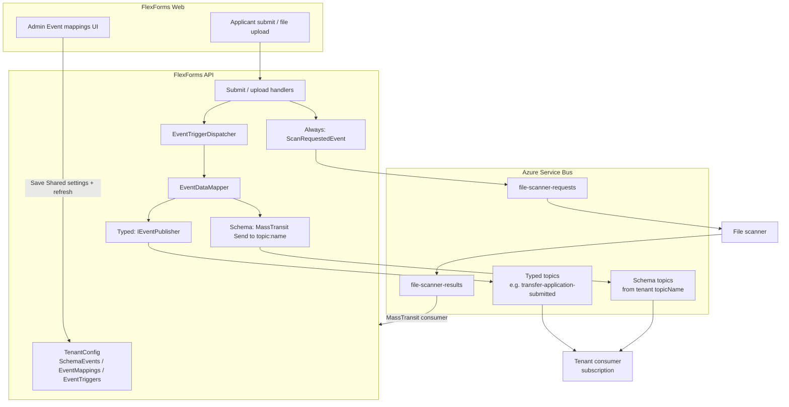

Publish is **best-effort**: a mapping or bus failure does not roll back the user’s submit/upload. Runtime mapping lookup is **template id + event type** (not mapping id). Empty EventTriggers means no extra publish besides scan-on-upload.

### Email placeholder mappings (high-level design)

Web **does not send** emails. The **API** sends GOV.UK Notify messages on submit / contributor invite / access granted. Admins can add **extra** Notify personalisation from form answers by saving Shared TenantConfig category **`EmailPlaceholderMappings`** (Tenant Settings JSON — no dedicated Admin page yet).

| Category | Role |
|----------|------|
| `EmailTemplates` | Notify template GUIDs per application type + email type (platform / SuperAdmin) |
| `EmailPlaceholderMappings` | Per template + email type: form / metadata → Notify `((placeholder))` keys (same DSL as `EventMappings`) |

Baseline personalisation (name, reference, dates) is always sent. Configured mappings **overlay** those keys. Operator steps: [`docs/Tenant-Admin-User-Manual.md`](docs/Tenant-Admin-User-Manual.md#13-email-placeholder-mappings) §13. Runtime detail: [flexforms-api README — Email placeholder mappings](https://github.com/DFE-Digital/flexforms-api#email-placeholder-mappings-notify-personalisation).

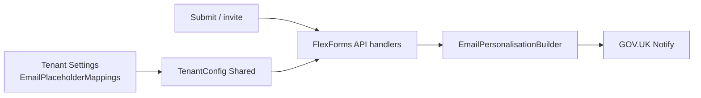

---

## Applications, contributors, notifications

| Feature | Routes / notes |
|---------|----------------|
| Dashboard | `/applications/dashboard` — list, filter, create |
| Form | `/applications/{ref}/…` |
| Contributors | `/applications/{ref}/contributors`, `…/invite` when `contributorPattern: true` |
| Submitted | `/application-submitted/{referenceNumber}` |
| Notifications | `/Notifications` UI + `notifications/*` API proxy; SignalR `notification.upserted` |
| Feedback | `/Feedback/*` (often anonymous) |
| Emails | Sent by the API (Notify). Optional custom placeholders: Tenant Settings → `EmailPlaceholderMappings` ([§13](docs/Tenant-Admin-User-Manual.md#13-email-placeholder-mappings)) |

Terminology (application vs case, etc.) comes from tenant `ApplicationTerminology` settings.

---

## File validation (tenant integrations)

Virus scanning stays platform-owned (Service Bus → `ScanResultConsumer` → malware notification + delete). Tenants can also run their **own** checks (for example Excel schema) via the API callback. Web only displays status, live updates, and the submit gate.

Configure on the API: Tenant Settings category `FileValidation`, Target `Shared`. Full callback contract and auth: [flexforms-api README — File validation](https://github.com/DFE-Digital/flexforms-api#file-validation-callback-tenant-integrations).

```json
{
  "DefaultMode": "RequirePassed",
  "Extensions": [ ".xlsx", ".xls" ],
  "Templates": {
    "aaaaaaaa-bbbb-cccc-dddd-eeeeeeeeeeee": "RequirePassed"
  }
}
```

| Mode | Submit behaviour |
|------|------------------|
| `Off` | Ignore validation (default) |
| `FailOnInvalid` | Block only when a file is `Failed` |
| `RequirePassed` | Eligible files must be `Passed` (`Pending` also blocks) |

`Extensions` is optional. Omit or `[]` → every upload is eligible when mode is not `Off`. Set e.g. `[".xlsx"]` so JPEG/PNG stay `NotRequired` (no pending label, never block submit) while Excel is validated.

### What the applicant sees

| Surface | Behaviour |
|---------|-----------|
| Upload field Status column | `Validation pending` / `Validated` / `Validation failed` (or `—` when `NotRequired`) |
| Preview submit | Disabled when `GetFileValidationGateAsync` returns `canSubmit: false`; lists blocking file names |
| Banner | GOV.UK error/success from SignalR `notification.upserted` (category `file-validation`) |
| Nav badge + `/Notifications` | Same notification store as file-delete / malware (`Context` = tenant `ApplicationName`) |

Live updates: stay on the upload page when the tenant function POSTs a result. The Status cell and banner change without a refresh. The preview submit-gate list still needs a reload.

Failed validation **keeps** the file (unlike malware, which deletes it). The tenant function must not call the product `Api.Client` with an API key — use a narrow HTTP call to the integrations endpoint.

---

## Security

| Topic | Behaviour |
|-------|-----------|
| AuthN | Cookie + OIDC/Entra; API via exchanged JWT |
| AuthZ | Folder policy `OpenIdConnectPolicy`; admin policies from `AdminAccessHelper` |
| CSRF | Antiforgery on POSTs (`SessionController`, notifications, forms) |
| Tenant binding | Hostname / header → config; API calls send `X-Tenant-ID` |
| Secrets | Not stored in Web DB; Tenant Settings secrets encrypted in API |
| Sanitisation | HtmlSanitizer + Markdig for tooltips/descriptions |
| HSTS | Enabled outside Development |
| Health | `/health`, `/healthz`, `/liveness` anonymous |

Permission claim shape (from API): `{ResourceType}:{ResourceKey}:{AccessType}`.

---

## Request pipeline (simplified)

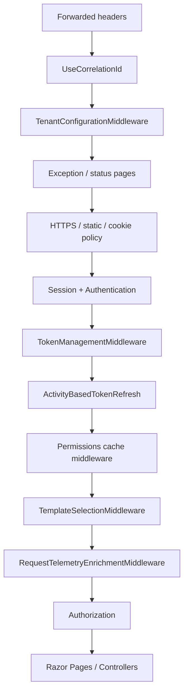

---

## Relationship to flexforms-api

| Concern | Mechanism |
|---------|-----------|
| Package | `GovUK.Dfe.FlexForms.Api.Client` — **NuGet in CI**; local **project reference** to `flexforms-api` while developing telemetry/client changes |
| CoreLibs | `GovUK.Dfe.CoreLibs.Http` — **project reference** to `DfE.CoreLibs` locally (correlation + generic SaaS telemetry); publish NuGet for CI |
| Platform HTTP | `/v1/host-config`, `/v1/tenant-config/resolve`, `/v1/tenant-config/tenants/{id}` |
| Business clients | `IApplicationsClient`, `ITemplatesClient`, `IUsersClient`, `IRolesClient`, `INotificationsClient`, `ITenantAdminClient`, `ITokensClient`, … |
| Auth to API | Token exchange + `X-Tenant-ID` |
| Tracing headers | `x-correlationId`, optional `X-Template-Id`, `X-Application-Reference` |
| Contracts | `GovUK.Dfe.CoreLibs.Contracts.ExternalApplications.*` (namespace historical; product is FlexForms) |

Web does **not** own SQL for applications/templates/users — the API does.

---

## Local development

### Prerequisites

- .NET 10 SDK
- Running FlexForms API with TenantConfig populated (tenant, hostname, Web settings, principal for Web MI/SP if using app-only consume)
- Redis (typical) and Entra / DfE credentials in user secrets

### Bootstrap secrets

Configure (user secrets or env):

- `PlatformBootstrap:ApiBaseUrl`
- `PlatformBootstrap:Scope`, `ClientId`, `ClientSecret` (or DefaultAzureCredential)
- Directory tenant id as required by your environment

### Data Protection (session cookies)

Session and cookie-auth cookies are protected with ASP.NET Data Protection. **Local** (no BlobUri / KeyVault) keeps a per-machine key ring. **Any Azure environment** — including Dev with `ASPNETCORE_ENVIRONMENT=Development` — must set BlobUri and KeyVaultKeyId so replicas share one ring, or you get `The key {…} was not found in the key ring` on `CookieProtection.Unprotect` (and follow-on 401s from token exchange).

Same Azure pattern as the API. Use a **different blob** and `ApplicationName` so Web cookie keys are not mixed with API TenantSettings keys.

| Key | Purpose |
|-----|---------|
| `DataProtection:UseAzure` | `true` in Azure. Local keeps a machine ring when BlobUri/KeyVault are empty |
| `DataProtection:ApplicationName` | `GovUK.Dfe.FlexForms.Web` (do not change after go-live) |
| `DataProtection:BlobUri` | `https://{account}.blob.core.windows.net/{container}/web-keys.xml` — **not** `api-keys.xml` |
| `DataProtection:KeyVaultKeyId` | Key Vault key URI used to wrap the ring |
| `DataProtection:UseStorageSas` | Local Azure opt-in; BlobUri must include a SAS query string |

Container App env (colon → double underscore):

```
DataProtection__UseAzure=true
DataProtection__ApplicationName=GovUK.Dfe.FlexForms.Web
DataProtection__BlobUri=https://<account>.blob.core.windows.net/<container>/web-keys.xml
DataProtection__KeyVaultKeyId=https://<vault>.vault.azure.net/keys/<web-cookie-dp>
```

The Web managed identity needs Blob **read/write** on that blob and Key Vault **unwrap/wrap** (or get + decrypt) on the key. After deploy, users with cookies from the old per-replica ring must sign in again once.

Azure Dev often uses `ASPNETCORE_ENVIRONMENT=Development`. The app still uses **managed identity** there (it detects `IDENTITY_ENDPOINT`). Do not set `DataProtection__UseStorageSas=true` on Azure.

### Launch profiles

See `Properties/launchSettings.json`:

| Profile | Typical URL | Notes |
|---------|-------------|-------|
| `Platform-https` / `Transfers-https` | `https://localhost:7020` | Needs TenantConfig hostname mapping for `localhost` if used |
| `Lsrp-https` | `https://lsrp.localhost:7020` | Hostname → LSRP tenant |
| `Visits-https` | `https://rgvisits.localhost:7020` | Often Entra-enabled tenant |

### Run

```bash
dotnet run --project src/GovUK.Dfe.FlexForms.Web --launch-profile Lsrp-https
```

### Tests

```bash
dotnet test GovUK.Dfe.FlexForms.Web.sln
```

Cypress specs live under `src/Tests/GovUK.Dfe.FlexForms.CypressTests/` (optional Test auth).

---

## Key routes

| Route | Purpose |
|-------|---------|
| `/` | Redirect to dashboard |
| `/applications/dashboard` | Application list |
| `/applications/{ref}/{taskId?}/{*pageId}` | Form engine |
| `/templates` | Template picker / preview |
| `/admin` | Admin hub |
| `/Notifications` | Notifications |
| `/Logout` | Sign out |
| `/Feedback/*` | Feedback |
| `/Cookies`, `/Privacy`, `/Terms` | Static |
| `/health*` | Probes |

---

## Form save flow

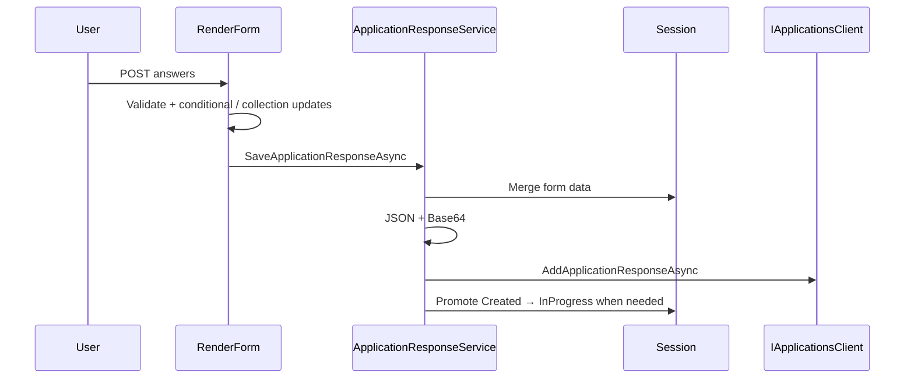

---

## Related documentation

- [`docs/Form-Template-Designer-Manual.md`](docs/Form-Template-Designer-Manual.md) — JSON template authoring
- [`docs/Tenant-Admin-User-Manual.md`](docs/Tenant-Admin-User-Manual.md) — tenant Admin UI, including [event mappings §12](docs/Tenant-Admin-User-Manual.md#12-event-mappings) and [email placeholders §13](docs/Tenant-Admin-User-Manual.md#13-email-placeholder-mappings)
- [Event mapping (HLD)](#event-mapping-high-level-design) — Web vs API vs Azure Service Bus
- [Email placeholder mappings (HLD)](#email-placeholder-mappings-high-level-design) — Notify personalisation from form fields
- [flexforms-api README](https://github.com/DFE-Digital/flexforms-api) — API, TenantConfig, roles, security, file-validation callback, [email placeholders](https://github.com/DFE-Digital/flexforms-api#email-placeholder-mappings-notify-personalisation)
- DfE.CoreLibs `GovUK.Dfe.CoreLibs.Http/ExceptionHandler.md` — global exception handler + KQL support playbook
- `terraform/README.md` — deployment

---

## Related repositories

| Repo | Role |
|------|------|
| flexforms-api | API, TenantConfig, EA data |
| rsd-file-scanner-function / rsd-clamav-api | Antivirus pipeline |
| DfE.CoreLibs | Contracts, security, caching helpers |
