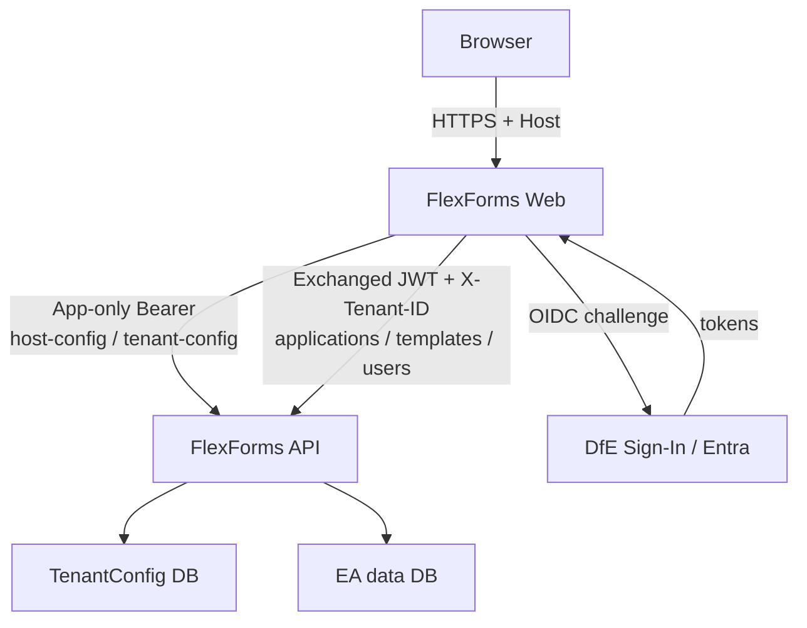
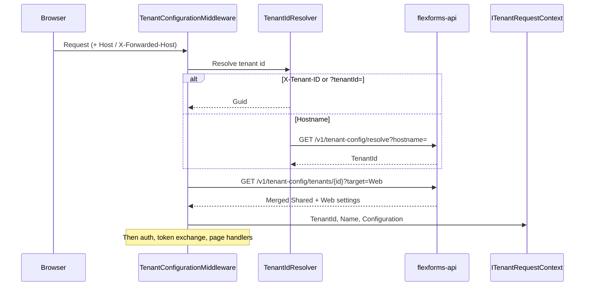
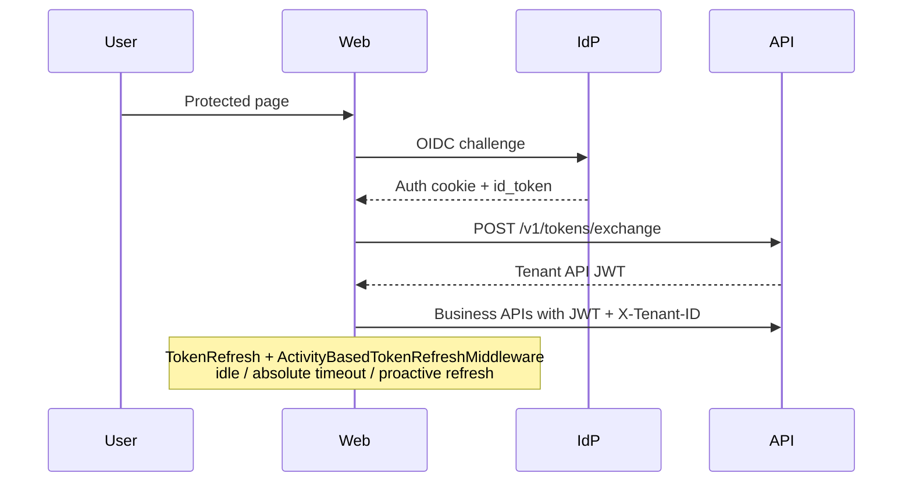
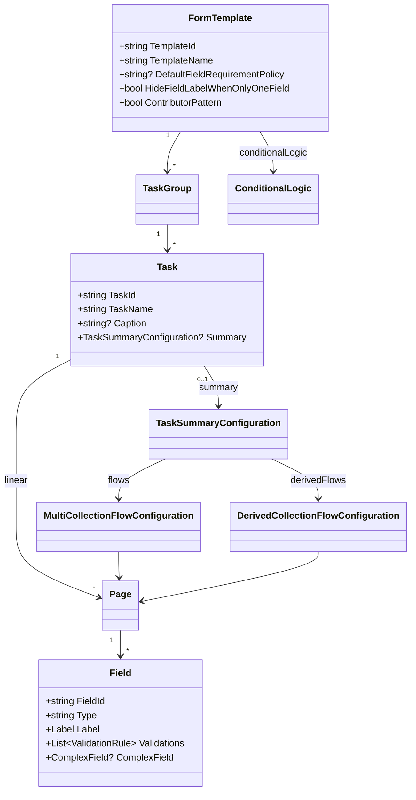
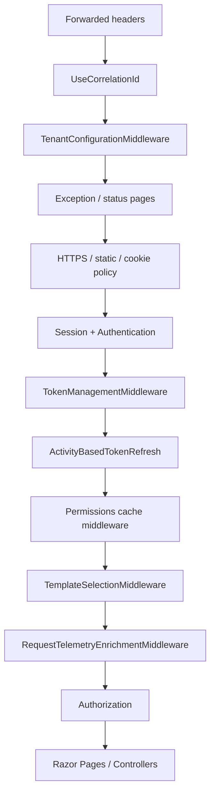
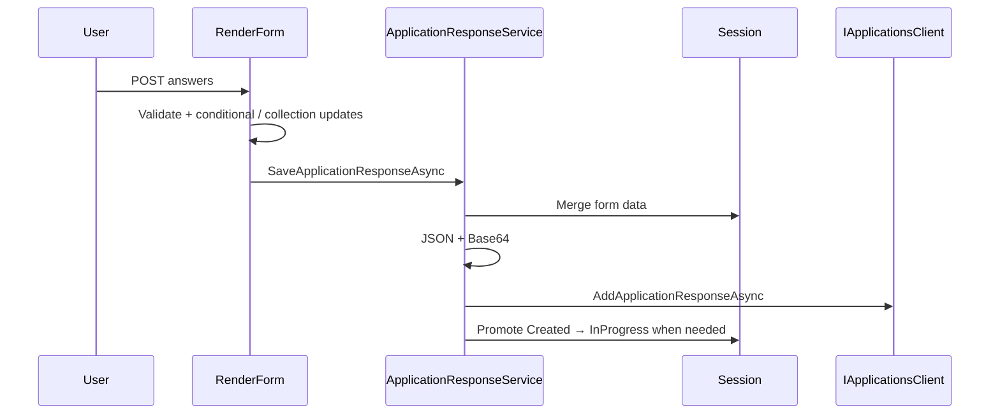

# FlexForms Web

Multi-tenant Razor Pages frontend for **FlexForms** — a SaaS form platform that turns JSON templates into GOV.UK task-list applications.

Each tenant (Transfers, Visits, LSRP, …) is resolved from hostname or `X-Tenant-ID`. Configuration is loaded from **flexforms-api** TenantConfig (not from per-product folders). Persistence and business rules live in the API; this repo owns UI, auth cookies, form orchestration, and admin tools.

Template authoring guide: [`docs/Form-Template-Designer-Manual.md`](docs/Form-Template-Designer-Manual.md).

---

## Features

- **Platform bootstrap** — Host config from API at startup; per-request tenant config for Target `Web`
- **Template-driven form engine** — Tasks, pages, fields, conditional logic, collection & derived flows
- **Auth** — DfE Sign-In (OIDC) and optional Entra SSO, with cookie sessions and API token exchange
- **Admin area** — Template Manager, User Manager, Role Manager, Tenant Settings (SuperAdmin)
- **Contributors** — Invite collaborators when `contributorPattern` is enabled on the template
- **Files** — Upload via API; ClamAV scan results from Service Bus; optional tenant file-validation status
- **Notifications** — API-backed notification centre + SignalR (malware, file delete, file validation)
- **GOV.UK Frontend** — Design System components via GovUk.Frontend.AspNetCore
- **Request tracing** — Correlation id end-to-end, structured logs (Serilog → Application Insights), API error logging with ErrorId

---

## Architecture overview

| Layer | Project | Purpose |
|-------|---------|---------|
| Web | `GovUK.Dfe.FlexForms.Web` | Razor Pages, middleware, auth overlays, admin |
| Application | `GovUK.Dfe.FlexForms.Application` | Interfaces; references `GovUK.Dfe.FlexForms.Api.Client` |
| Domain | `GovUK.Dfe.FlexForms.Domain` | `FormTemplate` models, conditional logic, complex fields |
| Infrastructure | `GovUK.Dfe.FlexForms.Infrastructure` | API template store, form services, MassTransit consumers |



---

## Multi-tenant bootstrap and request flow

### Startup (platform host config)

`PlatformBootstrap:Enabled` must be `true`. On start:

1. Load `appsettings.bootstrap.json` + environment + user secrets.
2. Acquire an **app-only Entra token** (`PlatformAccessTokenProvider`).
3. Call `GET /v1/host-config?target=Web`.
4. Merge host keys into `IConfiguration`.

Legacy `configurations/{APPLICATION_NAME}/` folders are **not** used.

### Per request (tenant)



**Tenant id order** (`TenantIdResolver`):

1. Header `X-Tenant-ID`
2. Query `tenantId`
3. Public hostname (`X-Forwarded-Host` → `Request.Host`) → API resolve

Prefer launch profiles that use `*.localhost` hostnames mapped in TenantConfig (e.g. `lsrp.localhost`, `rgvisits.localhost`).

**API business calls** get `X-Tenant-ID` from `TenantApiClientSettingsProvider` / Api.Client `HeaderForwardingHandler`.

---

## Observability and request tracing

Structured logging uses **Serilog** with `Enrich.FromLogContext()` and an Application Insights sink (`ExceptionTrackingTelemetryConverter`). Disable the default App Insights `ILogger` provider so all telemetry flows through Serilog.

### Correlation id

- Header: `x-correlationId` (GUID) on every browser request and outbound API call.
- Middleware: CoreLibs `UseCorrelationId()` (replaces the former local middleware).
- Log scope key: `CorrelationId` (canonical name for App Insights `customDimensions`).

### Request telemetry scopes

After auth and template selection, `RequestTelemetryEnrichmentMiddleware` populates:

| Property | Source |
|----------|--------|
| `CorrelationId` | CoreLibs correlation middleware |
| `TenantId`, `TenantName` | `ITenantRequestContext` |
| `UserId`, `UserEmail` | Authenticated claims |
| `TemplateId`, `ApplicationReference` | Session (when configured) |
| `ServiceName` | `flexforms-web` |

FlexForms-specific keys live in `Telemetry/FlexFormsLogContextKeys.cs` and `IFlexFormsRequestScope` — not in the shared CoreLibs NuGet.

### Outbound API headers

`CorrelationIdForwardingHandler` (global `HttpClient` default) forwards:

- `x-correlationId`
- `X-Template-Id` / `X-Application-Reference` when session is available (skipped during early tenant bootstrap before `UseSession()`)

Api.Client `HeaderForwardingHandler` also forwards tenant and auth headers on typed API clients.

### API error logging

`ExternalApiPageExceptionFilter` and `ExternalApiMvcExceptionFilter` log every API failure with `ErrorId`, `StatusCode`, `CorrelationId`, `TenantId`, `UserEmail`, `TemplateId`, and path — then redirect or return the appropriate UX. The user-facing error page can show the API `ErrorId` from TempData.

`TokenExchangeHandler` logs exchange failures (no silent catches).

### Support queries (Application Insights)

End-user provides **ErrorId** from the error page → search traces/exceptions by `customDimensions.ErrorId` → follow `customDimensions.CorrelationId` for the full Web + API chain.

Example:

```kusto
union traces, exceptions
| where customDimensions.ErrorId == "P-123456"
| project timestamp, cloud_RoleName, message,
          customDimensions.CorrelationId, customDimensions.TenantId,
          customDimensions.UserEmail, customDimensions.TemplateId
| order by timestamp asc
```

Generic CoreLibs keys and more KQL examples: `DfE.CoreLibs.Http/ExceptionHandler.md`.

---

## Authentication

### Scheme selection

`DynamicAuthenticationSchemeProvider` / composite strategy (priority):

1. Internal service headers (`x-service-email` + API key)
2. Test authentication (when enabled)
3. **Entra SSO** when tenant `EntraSso:Enabled`
4. Else **DfE Sign-In OIDC**

Cookies are the authenticate / sign-in / sign-out scheme. Challenge uses Entra or OpenIdConnect.

### DfE Sign-In

- Registered via CoreLibs custom OIDC.
- Per-request overlay: `TenantAwareOpenIdConnectConfigurator` (ClientId, authority, redirects from tenant settings).
- Callbacks: `/signin-oidc`, `/signout-callback-oidc`.

### Entra SSO

- Always registered; activated when tenant enables it.
- Overlay: `TenantAwareEntraSsoConfigurator`.
- Callbacks: `/signin-entra`, `/signout-callback-entra`.

### Token exchange and refresh



- `ExternalApplicationsApiClient:RequestTokenExchange` is forced on when platform bootstrap is enabled.
- Session tickets use distributed cache ticket store.
- `TokenRefresh` settings (tenant-aware): refresh lead time, force logout window, inactivity and absolute timeouts.
- Stay-signed-in: `SessionController` + antiforgery.

### Roles in the UI

| Role / claim | Capabilities |
|--------------|--------------|
| **SuperAdmin** | All admin + **Tenant Settings**; can assign tenant Admin |
| **Admin** | Template / User / Role managers within tenant |
| **Custom Manage claims** | e.g. `Template:Any:Manage`, `User:Any:Manage` open Admin hub / tools |
| **User** | Applications, form fill, contributors (if enabled) |

See `Security/AdminAccessHelper.cs`.

---

## Form engine

### Domain model



Full authoring reference: [`docs/Form-Template-Designer-Manual.md`](docs/Form-Template-Designer-Manual.md).

### Runtime flow

| Concern | Implementation |
|---------|----------------|
| Entry route | `/applications/{referenceNumber}/{taskId?}/{*pageId}` → `RenderForm` |
| Template load | `ITemplatesClient` → `ApiTemplateStore` → `JsonFormTemplateParser` |
| Navigation | `FormStateManager`, `FormNavigationService` |
| Save | Session accumulate → Base64 JSON → `AddApplicationResponseAsync` |
| Conditional logic | `ConditionalLogicEngine` / orchestrator |
| Collections | Multi + derived flow handlers on `RenderForm` |
| Complex fields | Tenant `FormEngine:ComplexFields` (Trust/Academy search, uploads) |
| File validation | Status column on upload fields; `GetFileValidationGateAsync` blocks preview submit when the API gate says so |
| Submit | `SubmitApplicationAsync` + `ApplicationSubmissionOrchestrator` (e.g. publish event) |

### Template selection

`TemplateSelectionMiddleware`:

- Multiple live templates → `/templates?liveOnly=true`
- Single live → auto-select
- Admins can preview non-live templates

---

## Admin area

Hub: `/admin` (`CanAccessAdminArea`).

| Tool | Route | Who |
|------|-------|-----|
| Template Manager | `/admin/template-manager` | Admin / SuperAdmin / Template Manage |
| Create Template | `/admin/create-template` | Same |
| Custom status labels | `/admin/custom-status-label-overrides` | Same |
| User Manager | `/admin/user-manager` | Admin / SuperAdmin / User Manage |
| Role Manager | `/admin/role-manager` | Admin / SuperAdmin |
| Tenant Settings | `/admin/tenant-settings` | **SuperAdmin only** |

Tenant Settings uses `ITenantAdminClient` (Base64 settings payloads), then refreshes API tenant cache and local `ITenantConfigurationCache`.

---

## Applications, contributors, notifications

| Feature | Routes / notes |
|---------|----------------|
| Dashboard | `/applications/dashboard` — list, filter, create |
| Form | `/applications/{ref}/…` |
| Contributors | `/applications/{ref}/contributors`, `…/invite` when `contributorPattern: true` |
| Submitted | `/application-submitted/{referenceNumber}` |
| Notifications | `/Notifications` UI + `notifications/*` API proxy; SignalR `notification.upserted` |
| Feedback | `/Feedback/*` (often anonymous) |

Terminology (application vs case, etc.) comes from tenant `ApplicationTerminology` settings.

---

## File validation (tenant integrations)

Virus scanning stays platform-owned (Service Bus → `ScanResultConsumer` → malware notification + delete). Tenants can also run their **own** checks (for example Excel schema) via the API callback. Web only displays status, live updates, and the submit gate.

Configure on the API: Tenant Settings category `FileValidation`, Target `Shared`. Full callback contract and auth: [flexforms-api README — File validation](https://github.com/DFE-Digital/flexforms-api#file-validation-callback-tenant-integrations).

```json
{
  "DefaultMode": "RequirePassed",
  "Extensions": [ ".xlsx", ".xls" ],
  "Templates": {
    "aaaaaaaa-bbbb-cccc-dddd-eeeeeeeeeeee": "RequirePassed"
  }
}
```

| Mode | Submit behaviour |
|------|------------------|
| `Off` | Ignore validation (default) |
| `FailOnInvalid` | Block only when a file is `Failed` |
| `RequirePassed` | Eligible files must be `Passed` (`Pending` also blocks) |

`Extensions` is optional. Omit or `[]` → every upload is eligible when mode is not `Off`. Set e.g. `[".xlsx"]` so JPEG/PNG stay `NotRequired` (no pending label, never block submit) while Excel is validated.

### What the applicant sees

| Surface | Behaviour |
|---------|-----------|
| Upload field Status column | `Validation pending` / `Validated` / `Validation failed` (or `—` when `NotRequired`) |
| Preview submit | Disabled when `GetFileValidationGateAsync` returns `canSubmit: false`; lists blocking file names |
| Banner | GOV.UK error/success from SignalR `notification.upserted` (category `file-validation`) |
| Nav badge + `/Notifications` | Same notification store as file-delete / malware (`Context` = tenant `ApplicationName`) |

Live updates: stay on the upload page when the tenant function POSTs a result. The Status cell and banner change without a refresh. The preview submit-gate list still needs a reload.

Failed validation **keeps** the file (unlike malware, which deletes it). The tenant function must not call the product `Api.Client` with an API key — use a narrow HTTP call to the integrations endpoint.

---

## Security

| Topic | Behaviour |
|-------|-----------|
| AuthN | Cookie + OIDC/Entra; API via exchanged JWT |
| AuthZ | Folder policy `OpenIdConnectPolicy`; admin policies from `AdminAccessHelper` |
| CSRF | Antiforgery on POSTs (`SessionController`, notifications, forms) |
| Tenant binding | Hostname / header → config; API calls send `X-Tenant-ID` |
| Secrets | Not stored in Web DB; Tenant Settings secrets encrypted in API |
| Sanitisation | HtmlSanitizer + Markdig for tooltips/descriptions |
| HSTS | Enabled outside Development |
| Health | `/health`, `/healthz`, `/liveness` anonymous |

Permission claim shape (from API): `{ResourceType}:{ResourceKey}:{AccessType}`.

---

## Request pipeline (simplified)



---

## Relationship to flexforms-api

| Concern | Mechanism |
|---------|-----------|
| Package | `GovUK.Dfe.FlexForms.Api.Client` — **NuGet in CI**; local **project reference** to `flexforms-api` while developing telemetry/client changes |
| CoreLibs | `GovUK.Dfe.CoreLibs.Http` — **project reference** to `DfE.CoreLibs` locally (correlation + generic SaaS telemetry); publish NuGet for CI |
| Platform HTTP | `/v1/host-config`, `/v1/tenant-config/resolve`, `/v1/tenant-config/tenants/{id}` |
| Business clients | `IApplicationsClient`, `ITemplatesClient`, `IUsersClient`, `IRolesClient`, `INotificationsClient`, `ITenantAdminClient`, `ITokensClient`, … |
| Auth to API | Token exchange + `X-Tenant-ID` |
| Tracing headers | `x-correlationId`, optional `X-Template-Id`, `X-Application-Reference` |
| Contracts | `GovUK.Dfe.CoreLibs.Contracts.ExternalApplications.*` (namespace historical; product is FlexForms) |

Web does **not** own SQL for applications/templates/users — the API does.

---

## Local development

### Prerequisites

- .NET 10 SDK
- Running FlexForms API with TenantConfig populated (tenant, hostname, Web settings, principal for Web MI/SP if using app-only consume)
- Redis (typical) and Entra / DfE credentials in user secrets

### Bootstrap secrets

Configure (user secrets or env):

- `PlatformBootstrap:ApiBaseUrl`
- `PlatformBootstrap:Scope`, `ClientId`, `ClientSecret` (or DefaultAzureCredential)
- Directory tenant id as required by your environment

### Launch profiles

See `Properties/launchSettings.json`:

| Profile | Typical URL | Notes |
|---------|-------------|-------|
| `Platform-https` / `Transfers-https` | `https://localhost:7020` | Needs TenantConfig hostname mapping for `localhost` if used |
| `Lsrp-https` | `https://lsrp.localhost:7020` | Hostname → LSRP tenant |
| `Visits-https` | `https://rgvisits.localhost:7020` | Often Entra-enabled tenant |

### Run

```bash
dotnet run --project src/GovUK.Dfe.FlexForms.Web --launch-profile Lsrp-https
```

### Tests

```bash
dotnet test GovUK.Dfe.FlexForms.Web.sln
```

Cypress specs live under `src/Tests/GovUK.Dfe.FlexForms.CypressTests/` (optional Test auth).

---

## Key routes

| Route | Purpose |
|-------|---------|
| `/` | Redirect to dashboard |
| `/applications/dashboard` | Application list |
| `/applications/{ref}/{taskId?}/{*pageId}` | Form engine |
| `/templates` | Template picker / preview |
| `/admin` | Admin hub |
| `/Notifications` | Notifications |
| `/Logout` | Sign out |
| `/Feedback/*` | Feedback |
| `/Cookies`, `/Privacy`, `/Terms` | Static |
| `/health*` | Probes |

---

## Form save flow



---

## Related documentation

- [`docs/Form-Template-Designer-Manual.md`](docs/Form-Template-Designer-Manual.md) — JSON template authoring
- [flexforms-api README](https://github.com/DFE-Digital/flexforms-api) — API, TenantConfig, roles, security, file-validation callback
- DfE.CoreLibs `GovUK.Dfe.CoreLibs.Http/ExceptionHandler.md` — global exception handler + KQL support playbook
- `terraform/README.md` — deployment

---

## Related repositories

| Repo | Role |
|------|------|
| flexforms-api | API, TenantConfig, EA data |
| rsd-file-scanner-function / rsd-clamav-api | Antivirus pipeline |
| DfE.CoreLibs | Contracts, security, caching helpers |
