# FlexForms tenant admin user manual

A practical guide to the Admin area. Written for **tenant administrators** who run a FlexForms service for their organisation (for example Local SEND Reform Plans, Transfers, or Visits).

You do not need to be a developer to use this manual. Where a change is made in JSON (templates, some tenant settings), the steps still start from the screens you see.

**Related guide:** [Form Template Designer Manual](Form-Template-Designer-Manual.md) — how to design the JSON schema for a form.

---

## Contents

1. [Who this is for](#1-who-this-is-for)
2. [How FlexForms is organised](#2-how-flexforms-is-organised)
3. [Open Admin](#3-open-admin)
4. [Suggested first-week workflow](#4-suggested-first-week-workflow)
5. [Templates: create, version, preview, go live](#5-templates-create-version-preview-go-live)
6. [Custom status labels](#6-custom-status-labels)
7. [Dashboard columns (via the template)](#7-dashboard-columns-via-the-template)
8. [Users and form access](#8-users-and-form-access)
9. [Roles](#9-roles)
10. [Permissions — how they work](#10-permissions--how-they-work)
11. [Organisation settings](#11-organisation-settings)
12. [Event mappings](#12-event-mappings)
    - [12.1 What this page is for](#121-what-this-page-is-for)
    - [12.2 Events in plain English](#122-events-in-plain-english)
    - [12.3 Azure Service Bus for people who have never used it](#123-azure-service-bus-for-people-who-have-never-used-it)
    - [12.4 The three layers you must configure](#124-the-three-layers-you-must-configure)
    - [12.5 Typed events vs schema events](#125-typed-events-vs-schema-events)
    - [12.6 Recommended order of work](#126-recommended-order-of-work)
    - [12.7 Schema events — what to type on the page](#127-schema-events--what-to-type-on-the-page)
    - [12.8 Create the Service Bus topic and subscription](#128-create-the-service-bus-topic-and-subscription)
    - [12.9 Field mappings — how answers become a message](#129-field-mappings--how-answers-become-a-message)
    - [12.10 Mapping JSON reference](#1210-mapping-json-reference)
    - [12.11 Worked examples](#1211-worked-examples)
    - [12.12 Triggers — when the API actually publishes](#1212-triggers--when-the-api-actually-publishes)
    - [12.13 What the published message looks like](#1213-what-the-published-message-looks-like)
    - [12.14 How a downstream system should consume it](#1214-how-a-downstream-system-should-consume-it)
    - [12.15 Virus scanning (always on)](#1215-virus-scanning-always-on)
    - [12.16 Who can change this](#1216-who-can-change-this)
    - [12.17 Event mappings checklist](#1217-event-mappings-checklist)
    - [12.18 Troubleshooting event mappings](#1218-troubleshooting-event-mappings)
13. [Email placeholder mappings](#13-email-placeholder-mappings)
    - [13.1 What this is for](#131-what-this-is-for)
    - [13.2 How confirmation emails work](#132-how-confirmation-emails-work)
    - [13.3 Baseline placeholders (always sent)](#133-baseline-placeholders-always-sent)
    - [13.4 Recommended order of work](#134-recommended-order-of-work)
    - [13.5 Step by step — add a custom placeholder](#135-step-by-step--add-a-custom-placeholder)
    - [13.6 Mapping JSON shape](#136-mapping-json-shape)
    - [13.7 How to link a placeholder to a form field](#137-how-to-link-a-placeholder-to-a-form-field)
    - [13.8 Metadata keys you can use](#138-metadata-keys-you-can-use)
    - [13.9 Worked examples](#139-worked-examples)
    - [13.10 Who can change this](#1310-who-can-change-this)
    - [13.11 Email placeholders checklist](#1311-email-placeholders-checklist)
    - [13.12 Troubleshooting email placeholders](#1312-troubleshooting-email-placeholders)
14. [Tenant settings](#14-tenant-settings)
    - [14.1 Tenant health](#141-tenant-health)
    - [14.2 What a tenant Admin should usually change here](#142-what-a-tenant-admin-should-usually-change-here)
    - [14.3 What to leave for SuperAdmin / platform](#143-what-to-leave-for-superadmin--platform)
    - [14.4 How to add or update a setting](#144-how-to-add-or-update-a-setting)
    - [14.5 Audit log](#145-audit-log)
    - [14.6 File validation (tenant function)](#146-file-validation-tenant-function)
15. [Applications (admin list)](#15-applications-admin-list)
16. [What end users see](#16-what-end-users-see)
17. [System tools and caches](#17-system-tools-and-caches)
18. [Things only a SuperAdmin can do](#18-things-only-a-superadmin-can-do)
19. [Troubleshooting](#19-troubleshooting)
20. [Glossary](#20-glossary)

---

## 1. Who this is for

This manual is for people with the **Admin** role in a tenant (sometimes called tenant admin).

You can:

- Create and version forms (templates)
- Decide which forms are live for end users
- Give people access to forms
- Create custom roles (for example Caseworker or Template Manager)
- Change wording, banners, and dashboard listing options
- Configure how submissions are published (event mappings)
- Inspect tenant configuration and health

You should **not** normally change secrets, login providers, or database connection strings. Those belong to the platform team (**SuperAdmin**). They are listed in [Tenant settings](#14-tenant-settings) so you can recognise them and leave them alone.

### Other Admin-area roles

| Who | What they can do in Admin |
|-----|---------------------------|
| **Admin** (this manual) | Almost everything for *this* tenant, except creating other tenants and listing all platform tenants |
| **SuperAdmin** | Everything a tenant Admin can do, plus New tenant, Platform tenants, and assigning the Admin role |
| **Template Manager** (custom role) | Template tools on the Admin hub (create, version, go live, custom status labels). Not users, roles, or tenant settings |
| **User Manager** (custom role) | User Manager only. Not Role Manager, Contributor management, or templates |

If you only see some of the cards described below, your account may be a custom role rather than full Admin.

---

## 2. How FlexForms is organised

A few words you will see everywhere:

| Term | Meaning |
|------|---------|
| **Tenant** | Your organisation’s isolated copy of the service (hostname, users, forms, settings). Changes you make apply to this tenant only. |
| **Template** (also **form**) | The blueprint of a form: questions, task list, validation, dashboard columns. |
| **Version** | A saved snapshot of that blueprint. Users keep filling the version they started; new applications use the latest schema. |
| **Live / Not live** | Live forms appear for end users who have access. Not-live forms are drafts you can preview. |
| **Application** | One person’s (or team’s) filled-in form. Organisation settings can rename this word (for example “reform plan”). |
| **Role** | A named set of permissions (User, Admin, Caseworker, …). |
| **Form access** | Which templates a person can open and start. |

**Live is not the same as “saved”.** Saving a new template version does not publish it to end users. You still **Make live** on the Admin hub.

---

## 3. Open Admin

1. Sign in on your tenant hostname.
2. In the service navigation, select **Admin**.
3. You land on the **Admin** hub (`/admin`).

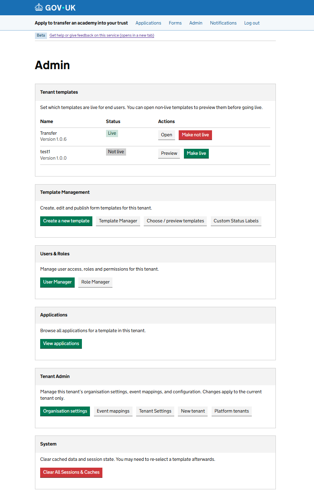

### Cards on the Admin hub

What you see depends on your role. A full tenant Admin typically sees:

| Card | What it is for |
|------|----------------|
| **Tenant templates** | List of forms, Live / Not live, Open / Preview, Make live / Make not live |
| **Template Management** | Create a new template, Template Manager, Choose / preview templates, Custom Status Labels |
| **Users & Roles** | User Manager (and Role Manager / Contributor management for Admin) |
| **Applications** | Browse every application for a chosen template |
| **Tenant Admin** | Organisation settings, Event mappings, Tenant Settings (including email placeholder mappings) |
| **System** | Clear All Sessions & Caches, plus optional diagnostics |

Tenant Admins (not SuperAdmins) also see a read-only summary: **This tenant’s configuration** (auth scheme, providers, hostnames).

---

## 4. Suggested first-week workflow

Use this if you are standing up a new form.

1. **Create a new template** (starts as not live, with a starter schema).
2. Open **Template Manager**, edit the JSON (or paste a designed schema), save a new version.
3. Optionally add **dashboard columns** and **contributor** settings in that JSON.
4. Set **custom status labels** if you want “In progress” to read as something else.
5. **Grant to all users** *or* add people individually in User Manager.
6. **Preview** the form from the Admin hub (Not live).
7. When ready, **Make live**.
8. Set **Organisation settings** (wording, banner, filters).
9. Create **Caseworker** / **Template Manager** roles if colleagues need limited Admin access.
10. If another system must receive submit or file-upload data, follow [Event mappings](#12-event-mappings) (schema, mapping, trigger, then Azure Service Bus topic and subscription).
11. If confirmation emails need form answers (for example academy name), follow [Email placeholder mappings](#13-email-placeholder-mappings) after the GOV.UK Notify template is ready.

---

## 5. Templates: create, version, preview, go live

### 5.1 Create a template

**Admin → Template Management → Create a new template**  
Page: `/admin/create-template`  
Title: **Create a template**

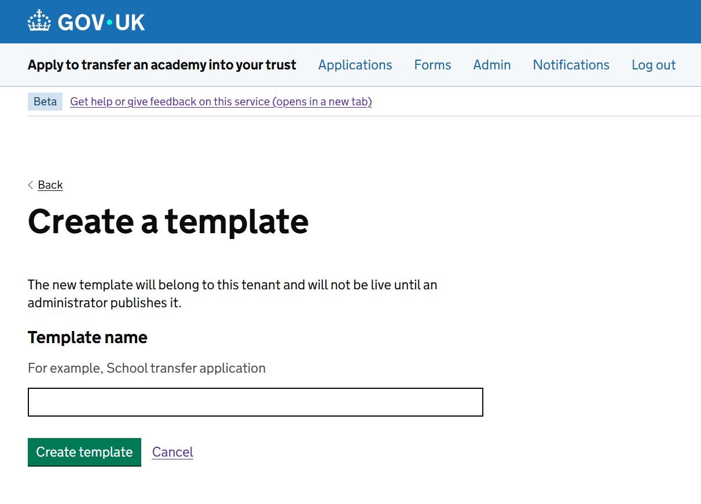

The page explains:

> The new template will belong to this tenant and will not be live until an administrator publishes it.

1. Enter a **Template name** (required, up to 100 characters). Hint example: “School transfer application”.
2. Select **Create template**.

What happens behind the button:

- The template is created for this tenant.
- Version **1.0.0** is added with a small starter form (one task group, one task, one page, one text field).
- You are taken to Template Manager with a success banner **Template created**, and the add-version form open with a suggested next version **1.0.1**.

The starter form is a scaffold. Replace it with your real schema before going live. Contributors are **off** on the starter (`contributorPattern` is false) until you enable them in JSON.

### 5.2 Make a form live or not live

This is only on the **Admin hub**, card **Tenant templates**. Template Manager does not publish.

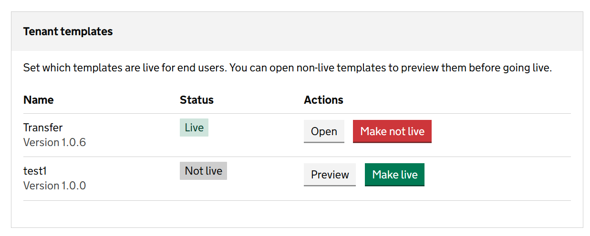

For each template you see:

- Name and latest version number
- Status tag: **Live** (green) or **Not live** (grey)
- **Open** (if live) or **Preview** (if not live)
- **Make live** or **Make not live**

**Open / Preview** selects that template in your session and takes you into the service as that form.

End users only see **live** forms they have been granted. Admins and Template Managers can still open not-live forms to preview them (an orange preview banner appears).

### 5.3 Template Manager

**Admin → Template Management → Template Manager**  
Page: `/admin/template-manager`

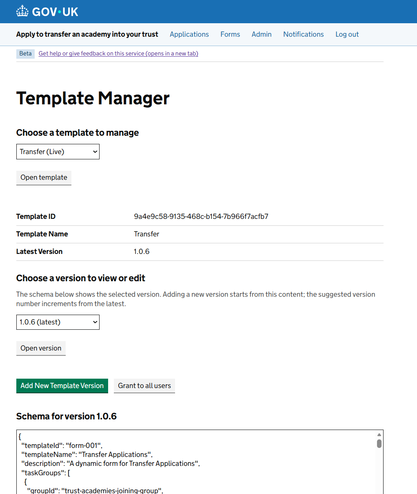

#### Choose a template

- **Choose a template to manage** — options show `(Live)` or `(Not live)`.
- Select **Open template**.

If the tenant has no templates, you see “There are no templates for this tenant” and a button to create one.

#### Choose a version

- Summary: Template ID, Template Name, Latest Version.
- **Choose a version to view or edit** — the latest is marked `(latest)`.
- Select **Open version**.
- A read-only **Schema for version …** textarea shows the JSON for that version.

Adding a new version **starts from the version you currently have open**, not necessarily the latest. The suggested version number still increments from the **latest**.

#### Add a new version

1. Select **Add New Template Version**.
2. **New Version Number** — for example `1.1`, `2.0`, `1.2.1`.
3. **JSON Schema** — prefilled from the version you opened. Edit it, or paste a schema produced with the [designer manual](Form-Template-Designer-Manual.md).
4. Read the reporting warning (shown in red). Tick:

   > I agree and confirm I have discussed any changes with the relevant data team

5. Select **Save New Version**.

If the JSON is invalid, the save is rejected and you should see **There is a problem** plus the specific messages (missing `taskGroups`, JSON parse error, and so on). Fix the schema and save again.

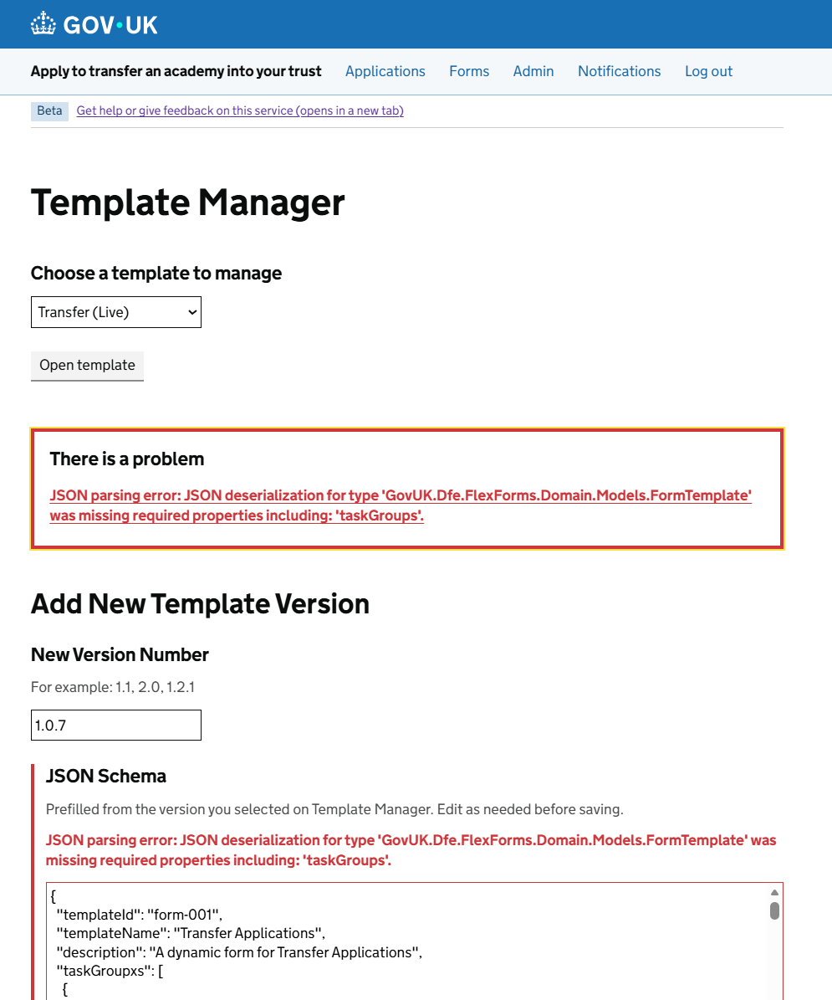

After a successful save: **Template version created successfully**. You are advised to **Clear all caches** so everyone picks up the new version immediately.

#### Grant to all users

Select **Grant to all users** and confirm.

This gives every **active** user in the tenant **read and write** access to *this* template. People who already had access are skipped.

Success banner example:

> Granted to 12 user(s). 3 already had access. Total tenant users checked: 15.

Use this for a service where everyone in the tenant should be able to start the form. For selective access, use User Manager instead.

### 5.4 Choose / preview templates (Forms)

**Admin → Template Management → Choose / preview templates**  
Also in the header as **Forms** when you have more than one form.  
Page: `/templates`  
Title: **Choose a form**

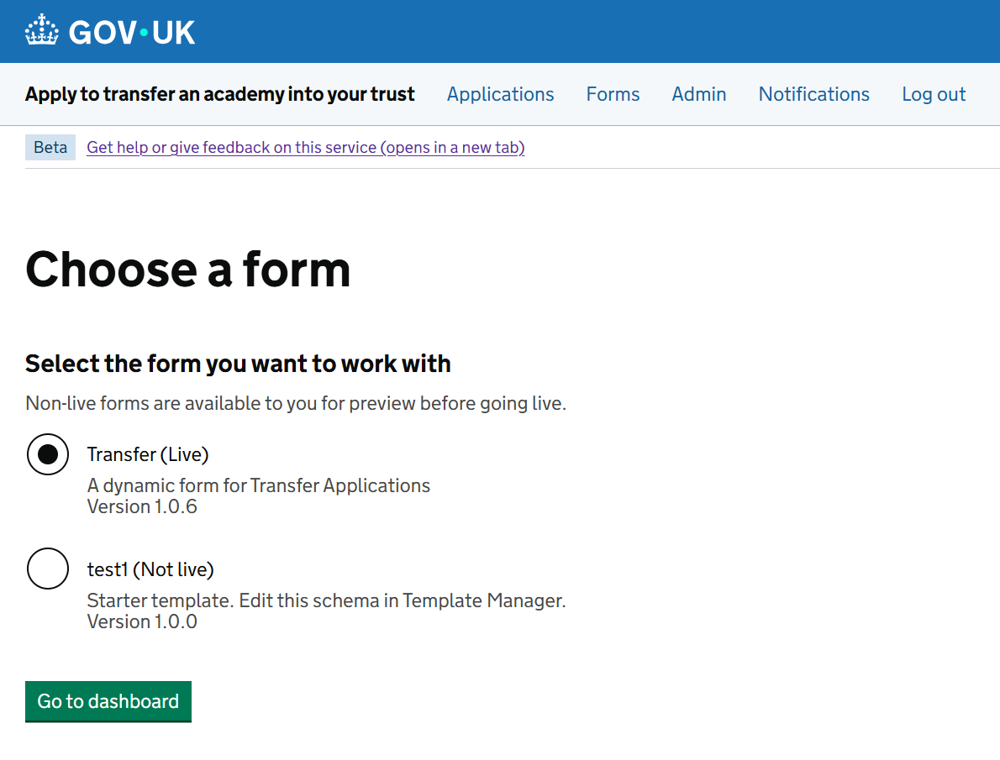

Admins see live and not-live forms (not-live labelled for preview). End users only see live forms they can access.

Select a form, then **Go to dashboard**.

---

## 6. Custom status labels

**Admin → Template Management → Custom Status Labels**  
Page: `/admin/custom-status-label-overrides`  
Title: **Admin - Custom Status Overrides**

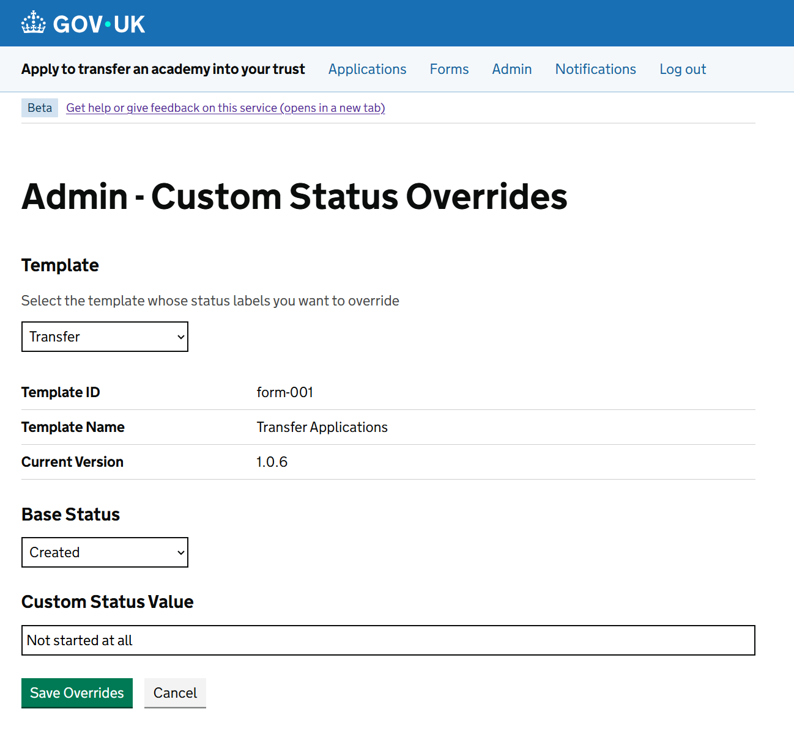

The underlying statuses stay the same (**Created**, **In progress**, **Submitted**, **Deleted**). You only change the **words people see** on dashboards, listings, and filters.

1. Choose a **Template**.
2. Choose a **Base Status**.
3. Enter the **Custom Status Value** (the label to show).
4. Select **Save Overrides**.

The cache refreshes immediately. Repeat for each base status you want to rename (for example “In progress” → “Draft”).

---

## 7. Dashboard columns (via the template)

There is **no Admin screen** for dashboard columns. You add them in the template JSON, then save a new version in Template Manager.

The applications dashboard (`/applications/dashboard`) heading defaults to **Your {plural}** and can be overridden in [Organisation settings](#11-organisation-settings). The table columns come from the template’s `"dashboard"` section.

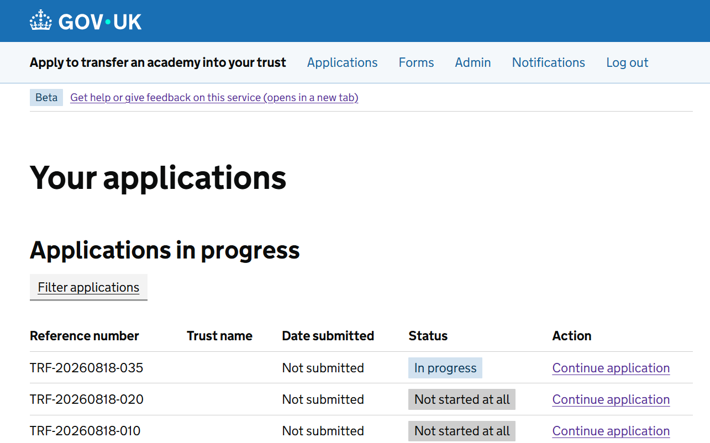

### Default columns

If you omit `"dashboard"`, users see:

- Reference number
- Date started
- Date submitted
- Status
- Action (always kept so people can open a row)

### Add your own columns

In the root of the template JSON:

```json
"dashboard": {
  "columns": [
    { "type": "system", "id": "reference", "order": 10 },
    { "type": "field", "fieldId": "incomingTrustName", "header": "Trust name", "order": 20 },
    { "type": "system", "id": "dateStarted", "order": 30 },
    { "type": "system", "id": "dateSubmitted", "order": 40 },
    { "type": "system", "id": "status", "order": 50 },
    { "type": "system", "id": "action", "order": 60 }
  ]
}
```

| You set | Meaning |
|---------|---------|
| `"type": "system"` | Built-in column. `id` is one of `reference`, `dateStarted`, `dateSubmitted`, `status`, `action`. |
| `"type": "field"` | Answer from the form. `fieldId` must match the question’s id. `header` is the column title. |
| `order` | Lower numbers appear first. |

**Rules you will feel in the UI:**

- At most **three** field columns (any extras are ignored).
- If you only list field columns, the default system columns are still added.
- Column **headings** come from the **latest** template version. Cell **values** come from each application’s own answers. Older applications show a blank cell if that field did not exist yet.
- Prefer simple answers (text, date, radios). File uploads do not work well in a table cell.

You can also point `fieldId` at a field inside a repeatable collection; several items are shown joined with commas. Full path rules are in the [designer manual, §3.1](Form-Template-Designer-Manual.md#31-dashboard-columns-dashboard).

After you save the version, **Make live** (if needed) and clear caches so the dashboard picks up the new headings.

### Filters on the dashboard

Whether filters appear is **not** in the template. Turn them on in Organisation settings (**Enable application filters**).

When enabled, **Filter {plural}** includes:

- Reference number (all or part)
- Status (uses your custom labels)
- Date started (from / to)
- Date submitted (from / to)

**Apply filters** / **Clear filters**. Page size is also set in Organisation settings.

---

## 8. Users and form access

**Admin → Users & Roles → User Manager**  
Page: `/admin/user-manager`

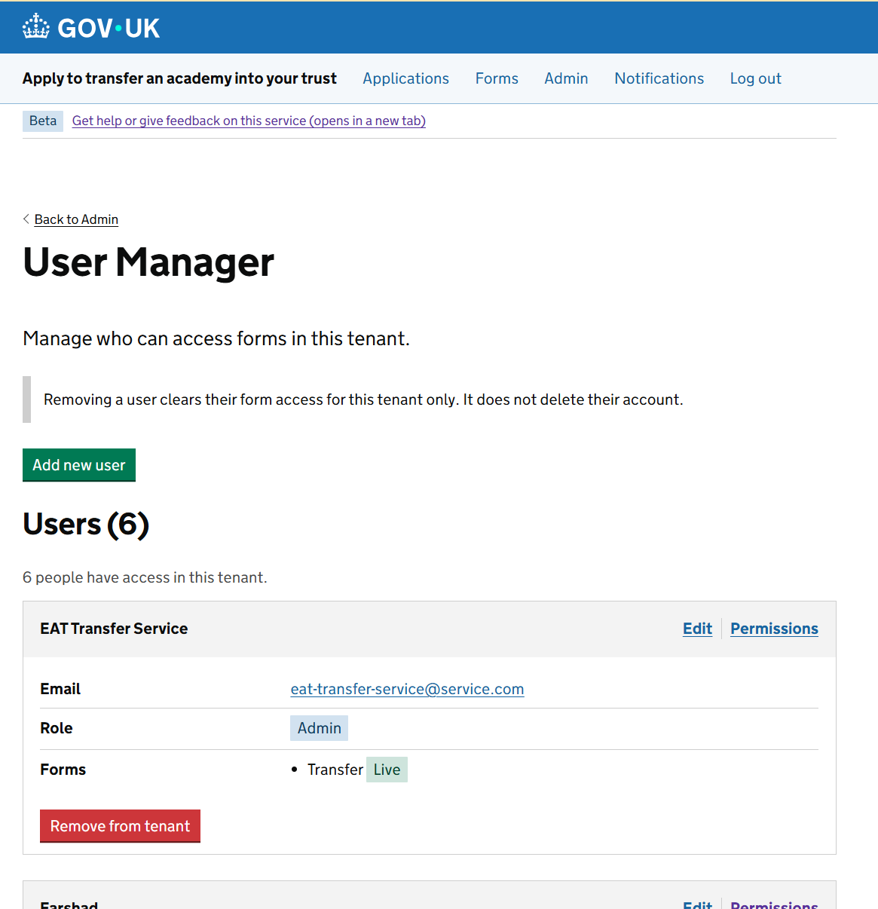

Lead copy: “Manage who can access forms in this tenant.”

Removing someone **does not delete their account**. It only clears their access in **this** tenant.

### 8.1 The user list

Each person is a card showing:

- Name, **Edit**, **Permissions**
- Email
- Role tag (User, Admin, Caseworker, custom roles, …)
- Forms they can access, with Live / Not live (and “Show all forms” if there are more than three)
- **Remove from tenant** (with a confirmation)

**Add new user** opens the add screen.

### 8.2 Add a user

Page: `/admin/user-manager/add`  
Title: **Add user**

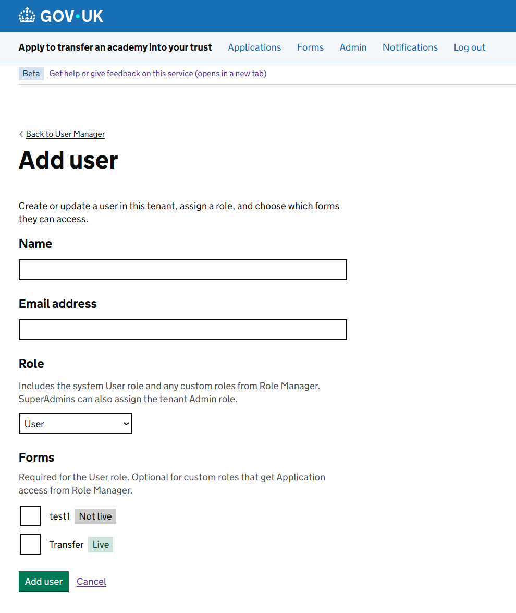

1. **Name** and **Email address**.
2. **Role** — the system **User** role plus any custom roles from Role Manager.  
   Only a **SuperAdmin** can assign the tenant **Admin** role. Tenant Admins do not see Admin in the list.
3. **Forms** — tick the templates this person should use.  
   Required for the **User** role. Optional for custom roles that already get application access from Role Manager (for example Caseworker).
4. Select **Add user**.

If the email already exists in this tenant, you will be told so.

### 8.3 Edit a user

Page: `/admin/user-manager/edit`  
Title: **Edit user**

Name and email are read-only. You can change **Role** and **Forms this user can access**, then **Save**.

Changing only form access does **not** change the person’s role. The access audit trail records that as form access updated, not as a new role assignment.

### 8.4 User-level permissions

From a user card, select **Permissions**.  
Page title: **Manage permissions**

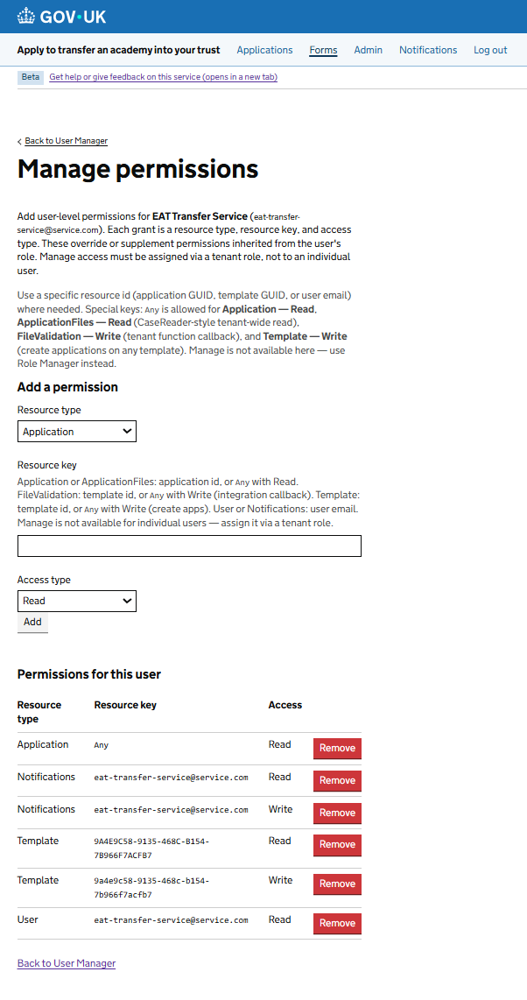

Use this for extra grants on top of the role (for example a one-off template). Each grant is:

- **Resource type** (Template, Application, ApplicationFiles, …)
- **Resource key** (usually a GUID, an email, or `Any` where allowed)
- **Access type** (Read, Write, Delete — **not** Manage)

**Manage** cannot be given to an individual. Create or assign a **role** that includes Manage instead (Role Manager).

Empty state: “No user-level permissions added yet.”

### 8.5 Access audit trail

At the bottom of User Manager: **Access audit trail**.

“Recent role assignment and access changes in this tenant (last 50).”

Columns: When (UTC), Subject email, Action, Role, Actor email, Details.

Typical actions:

| Action | When you see it |
|--------|-----------------|
| **RoleAssigned** | A user was created or their role changed |
| **FormAccessUpdated** | Their form (template) list was changed without a role change |
| **MembershipDeactivated** | They were removed from the tenant |

### 8.6 Grant to all vs User Manager

People who **auto-register** (first sign-in) do **not** get every live form:

| Live templates on the tenant | What the new user can open |
|------------------------------|----------------------------|
| None | Nothing — they stay signed in and see a message to ask an admin for form access |
| Exactly one | That form, automatically |
| More than one | Nothing (same message), unless a default template is configured (see below) |

They must still be able to sign in without a form. After you grant forms in User Manager, they should get access on the next page load (or after signing out and back in).

To auto-assign one form when several are live, a SuperAdmin sets Tenant Settings category **SelfRegistration** (Target **Shared**):

```json
{ "DefaultTemplateId": "the-live-template-guid" }
```

Web `ExternalApplicationsApiClient:DefaultTemplateId` is also used if present. The default must itself be **live**. Otherwise the user is created with no form access and you pick templates in User Manager.

| Need | Use |
|------|-----|
| Everyone in the tenant should use one form | Template Manager → **Grant to all users** |
| Only some people, or different forms per person | User Manager add/edit |
| A team that can see *all* applications | Role Manager → **Create Caseworker role**, then assign it in User Manager |

### 8.7 Contributors (application collaborators)

Invite/remove of extra people on **one application** is done from that application’s task list when the template has `"contributorPattern": true`.

Admins and SuperAdmins can also look up who is on an application, or look up a user by email to see the applications they created and who they invited, at **Admin → Users & Roles → Contributor management** (`/admin/contributor-management`). Custom User Manager roles cannot open this page.

---

## 9. Roles

**Admin → Users & Roles → Role Manager**  
Page: `/admin/role-manager`  
**Admin and SuperAdmin only.** Custom “user manager” roles cannot open this page.

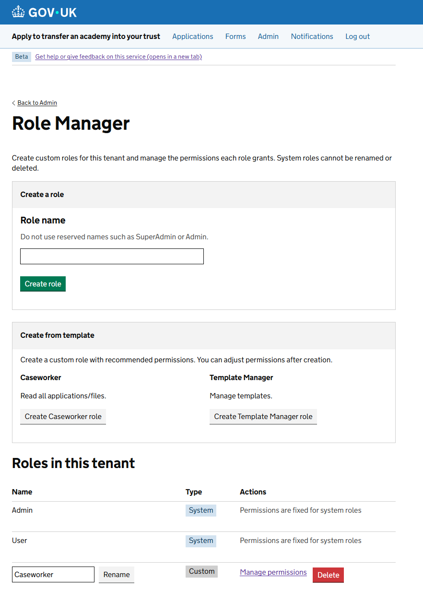

Copy on the page:

> Create custom roles for this tenant and manage the permissions each role grants. System roles cannot be renamed or deleted.

### 9.1 System roles (fixed)

| Role | Purpose |
|------|---------|
| **User** | Standard applicant. Needs at least one form ticked in User Manager unless a custom role already grants application access. |
| **Admin** | Tenant administrator (this manual). Assigned only by SuperAdmin. |
| **SuperAdmin** | Platform operator. Not something you assign from tenant User Manager. |

You cannot rename, delete, or edit permissions on system roles.

### 9.2 Create a blank custom role

1. Under **Create a role**, enter a **Role name** (do not use SuperAdmin or Admin).
2. Select **Create role**.
3. Select **Manage permissions** on that row and add grants (see [Permissions](#10-permissions--how-they-work)).
4. Assign the role to people in User Manager.

### 9.3 Create from template (recommended starters)

**Create from template** adds a custom role with a sensible starter set. You can change permissions afterwards.

| Button | What you get | Typical use |
|--------|----------------|-------------|
| **Create Caseworker role** | Read all applications and files in the tenant (`Application:Any:Read` and `ApplicationFiles:Any:Read`) | Staff who list and review everyone’s applications, without becoming Admin |
| **Create Template Manager role** | Manage templates (`Template:Any:Manage`) | Content owners who version forms and go live, without User Manager or Tenant Settings |

Then assign the role on **Add user** / **Edit user**.

### 9.4 Rename, permissions, delete

In **Roles in this tenant**:

- **Custom** rows: **Rename**, **Manage permissions**, **Delete**
- Delete asks you to confirm. Users must be moved off the role first.
- **System** rows: “Permissions are fixed for system roles”

---

## 10. Permissions — how they work

You can ignore this section until you need a custom role. Form checkboxes in User Manager are enough for most applicants.

### 10.1 The three-part grant

Every permission looks like:

**Resource type** + **Resource key** + **Access type**

Examples:

| Grant | Meaning |
|-------|---------|
| Template + *(that form’s ID)* + Read/Write | Can open and fill that form (what the Forms checkboxes set) |
| Template + `Any` + Manage | Template Manager tools on the Admin hub |
| Application + `Any` + Read | See all applications for a template (Caseworker-style **Applications** nav) |
| User + `Any` + Manage | User Manager |

Written out they look like `Template:Any:Manage`. You pick the three parts from dropdowns; you do not have to type the colons.

### 10.2 Role grants vs user grants

```
Role permissions  →  baseline for everyone with that role
        +
User Manager “Forms”  →  extra template access for that person
        +
User Permissions page  →  extra one-off grants (cannot include Manage)
```

Admin and SuperAdmin already bypass most of these checks.

### 10.3 Manage belongs on a role

**Manage** (templates or users) must be on a **role**, not on the user permissions page. That stops a User Manager from quietly making themselves a Template Manager without a named role.

### 10.4 When `Any` is allowed

The permissions screens hint this. `Any` is only valid for certain combinations, including:

- Application — Read  
- ApplicationFiles — Read  
- Template — Write (start applications on any template)  
- Template — Manage (roles only)  
- User — Manage (roles only)  
- FileValidation — Write (platform file-scanning callback)

For a single form, use that template’s GUID as the resource key (User Manager form ticks do this for you).

---

## 11. Organisation settings

**Admin → Tenant Admin → Organisation settings**  
Page: `/admin/organisation-settings`

This is the safe, form-based way to change how the service **looks and reads**. Prefer this over editing the same categories as raw JSON in Tenant Settings.

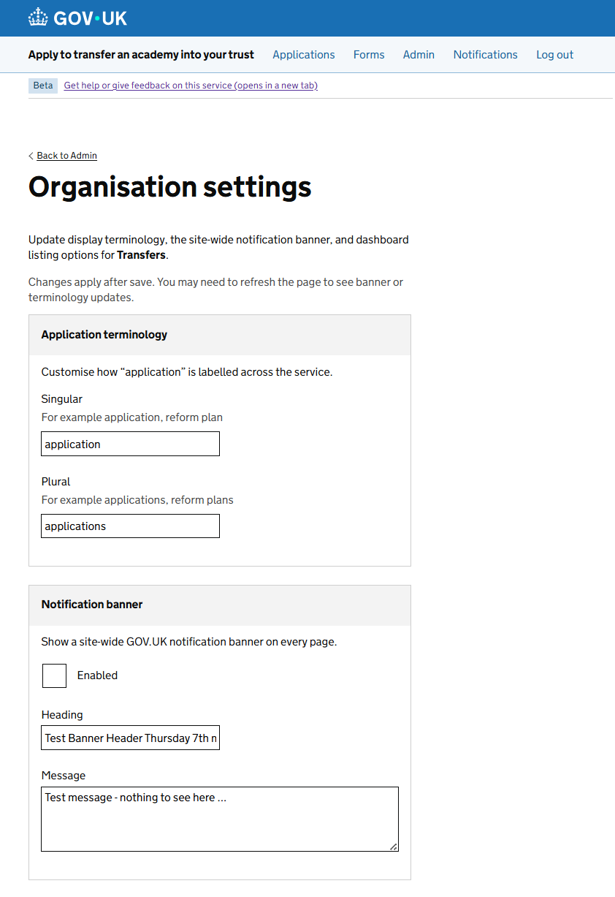

Lead copy: update display terminology, the site-wide notification banner, and dashboard options. You may need to refresh the browser after save to see banner, wording, or dashboard text changes.

Select **Save settings** at the bottom.

### 11.1 Application terminology

Customise how “application” is labelled across the service (headings, buttons, empty states).

| Field | Hint | Example |
|-------|------|---------|
| **Singular** | For example application, reform plan | `reform plan` |
| **Plural** | For example applications, reform plans | `reform plans` |

Effects you will notice:

- Dashboard title **Your reform plans** (unless overridden in Dashboard text)
- **Start a new reform plan** (unless overridden in Dashboard text)
- Filter panel **Filter reform plans**
- Admin applications list still says “applications” in the page title; day-to-day user language follows these terms

### 11.2 Notification banner

Show a GOV.UK notification banner on **every page** (for example “This is a test environment”).

| Field | Purpose |
|-------|---------|
| **Enabled** | Tick to show the banner |
| **Heading** | For example `Important` or `Warning` |
| **Message** | The body text |

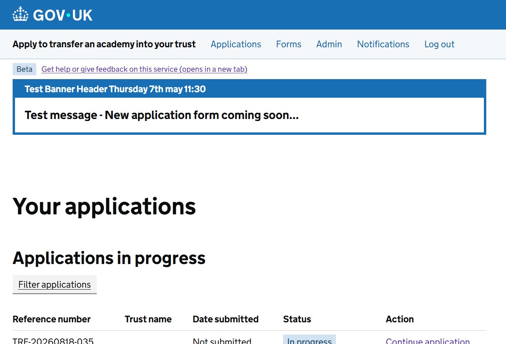

### 11.3 Dashboard

| Field | Purpose |
|-------|---------|
| **Page size** | How many rows per page (1 to 500, default 50) |
| **Enable application filters** | Shows the filter panel (reference, status, dates) |
| **Main heading** | Dashboard H1 (for example `Your visits`). Leave blank to use **Your {plural}** |
| **In-progress heading** | Heading above the list (for example `Visits in progress`). Leave blank to use **{Plural} in progress** |
| **Start new heading** | Heading for the start section. Leave blank to use **Start a new {singular}** |
| **Start new hint** | Supporting text under that heading. Leave blank for the default lead-applicant sentence |
| **Start new button text** | Primary button label. Leave blank to use **Start new {singular}** |

Listing options do **not** change which columns appear. Columns come from the template JSON ([section 7](#7-dashboard-columns-via-the-template)).

---

## 12. Event mappings

**Admin → Tenant Admin → Event mappings**  
Page: `/admin/event-mappings`

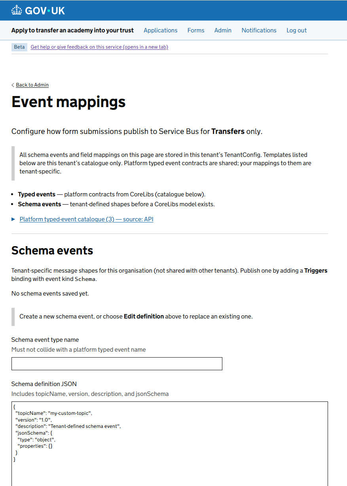

This chapter is the full guide. You can skip it if your tenant does **not** send form data to another system. If you do need reporting, data warehouse feeds, or a product-specific processor, read it even if you have never used Azure Service Bus.

High-level design for developers: [Event mapping (HLD)](../README.md#event-mapping-high-level-design) in the Web README.

### 12.1 What this page is for

FlexForms stores answers in its own database. Other teams often need a **copy of selected answers** (or file metadata) at the moment someone **submits a form** or **uploads a file**.

This page tells the FlexForms **API**:

1. **What shape** the outbound message should have (schema event, or a platform “typed” contract).
2. **Which form fields** (and platform facts such as application reference) go into that message (field mapping).
3. **When** to send it (trigger).

Nothing is sent until **all three** are in place for that form. Saving only a mapping, or only a schema, does not publish.

Configuration is stored in TenantConfig for **this tenant only** (categories `SchemaEvents`, `EventMappings`, `EventTriggers`, Target **Shared** so the API can read them). Other tenants cannot see your mappings.

If you have no reporting pipeline, leave the page empty. **No triggers configured yet** means submit and upload do not publish extra messages. Virus scanning still runs (see [12.15](#1215-virus-scanning-always-on)).

### 12.2 Events in plain English

| Everyday idea | What FlexForms calls it |
|---------------|-------------------------|
| “Something just happened that another system should hear about.” | An **event** (a message). |
| “The named moment we care about.” | A **trigger**: `ApplicationSubmitted` or `FileUploaded`. |
| “The label on the message so receivers know which recipe to use.” | **Event type** (for example `TransferApplicationSubmittedEvent` or `LsrpPlanSubmitted`). |
| “The pigeon-holes in Azure that messages land in.” | A Service Bus **topic**. |
| “A named inbox hanging off that pigeon-hole.” | A **subscription**. Your receiving app listens on a subscription, not on the topic itself. |
| “A recipe the platform team already coded in CoreLibs.” | A **typed** event. |
| “A recipe you invent for this tenant, described with JSON Schema.” | A **schema** event. |
| “How form answers are copied into the message.” | A **field mapping**. |

The FlexForms **Web** app is only the editor. The FlexForms **API** is the publisher. Your downstream app is the consumer.

Publishing is **best-effort**. If Service Bus is down or mapping JSON is wrong, the user’s submit or upload **still succeeds**. Failures are logged on the API. Always test in a non-production environment first.

### 12.3 Azure Service Bus for people who have never used it

Azure Service Bus is a Microsoft cloud **message broker**. Think of it as a post office:

1. FlexForms API **posts a letter** (publish / send).
2. The letter goes into a **topic** (a named pile, for example `lsrp-plan-submitted`).
3. Each interested system has a **subscription** (its own copy of that pile).
4. That system **reads letters** from its subscription.

You do **not** create a Service Bus namespace on this Admin page. The platform already points the API at a namespace via `MassTransit` settings (connection string or managed identity). Ask the platform team for:

- Namespace name (looks like `something.servicebus.windows.net`)
- Confirmation that the API identity can **Send** to topics
- Confirmation that your consumer identity can **Listen** on subscriptions

**Topics you usually do not create yourself** (platform / virus scan):

| Topic name | Used for |
|------------|----------|
| `file-scanner-requests` | API asks ClamAV to scan an upload (`ScanRequestedEvent`) |
| `file-scanner-results` | Scanner reports clean or infected (`ScanResultEvent`) |

**Typed product topics** (from CoreLibs `TopicNames` — the Admin catalogue shows the exact name):

| Example event type | Topic name today |
|--------------------|------------------|
| `TransferApplicationSubmittedEvent` | `transfer-application-submitted` |

If the catalogue shows **(no topic resolved)** for a typed event, MassTransit will not know where to publish it. Raise that with the platform team; they need a matching `TopicNames` constant in CoreLibs.

**Schema event topics** are **your** names. You choose `topicName` in the schema definition (for example `lsrp-plan-submitted`). That topic **must exist** in the **same** namespace the API uses. Production usually does **not** auto-create entities.

Naming tips for a new topic:

- Lowercase letters, numbers, hyphens
- Unique in the namespace
- Stable — changing `topicName` later means creating a new topic and moving consumers

### 12.4 The three layers you must configure

Work from the bottom of the page conceptually, even though the screen lists schema first:

```text
1. Schema event   (only if you are not using a platform typed event)
        ↓
2. Field mapping  (template + event type + mapping JSON)
        ↓
3. Trigger        (when to publish + kind Typed or Schema + mapping id)
        ↓
4. Service Bus    (topic exists; consumer has a subscription)
```

| Layer | TenantConfig category | What it does |
|-------|----------------------|--------------|
| Schema events | `SchemaEvents` | Names your message type and which topic to use |
| Field mappings | `EventMappings` | Copies form/metadata into properties |
| Triggers | `EventTriggers` | Binds a lifecycle moment to an event type |

The Admin page writes those categories for you. You can also inspect them under [Tenant settings](#14-tenant-settings), but prefer this page.

**A mapping does not publish by itself.** You must add a trigger that uses the same event type (and the same `mappingId` you put in the JSON).

At runtime the API finds the mapping by **template id + event type**. Keep `mappingId` identical on the mapping and the trigger so operators can tell them apart; do not reuse the same event type with two different mapping ids on one template (only one mapping is stored per template per event type).

### 12.5 Typed events vs schema events

| | **Typed** | **Schema** |
|---|-----------|------------|
| Who defines the contract | Platform (CoreLibs messaging contracts) | You, on this page |
| Where you see the list | Expand **Platform typed-event catalogue** | **Saved schema events** table |
| Topic | From CoreLibs (`TopicNames`) | Your `topicName` |
| Payload | Deserialised into a C# class | `SchemaEventEnvelope` with a dictionary `payload` |
| When to use | The event already exists (for example Transfers submit) | Your product is not in CoreLibs yet |
| Name clash | Reserved names | Must **not** equal a typed event name |

**Promote later:** when a schema event is stable, the platform can add a typed CoreLibs event. You would then create a typed mapping and trigger and retire the schema one.

**Do not** create a schema event named `ScanRequestedEvent`, `ScanResultEvent`, or any name already in the typed catalogue (for example `TransferApplicationSubmittedEvent`). The page will reject a clash with a typed name.

### 12.6 Recommended order of work

1. Agree with the receiving team: **submit**, **file upload**, or both; which fields they need.
2. Decide **typed** (use catalogue) or **schema** (invent a name + topic).
3. If schema: create the **topic and subscription** in Azure ([12.8](#128-create-the-service-bus-topic-and-subscription)), then **Save schema event**.
4. Open **Field mappings**: choose the **template** and **event type**, **Load mapping**, paste JSON, **Save mapping**.
5. Add a **Trigger** (`ApplicationSubmitted` and/or `FileUploaded`), kind **Typed** or **Schema**, mapping id matching the JSON, **Save trigger**.
6. Submit a test application (or upload a test file) in a non-prod tenant.
7. Confirm a message appears on the subscription (Azure Portal **peek**, or your consumer logs).
8. Ask the platform team to **Refresh** tenant configuration if a second API instance looks stale (this page already calls refresh on save).

### 12.7 Schema events — what to type on the page

**Schema event type name** is the `MessageType` consumers filter on. Use PascalCase without spaces, for example `LsrpPlanSubmitted`. This is **not** the Azure topic name.

**Schema definition JSON** must be a JSON **object** with at least:

| Property | Required | Meaning |
|----------|----------|---------|
| `topicName` | Yes | Exact Azure topic name |
| `jsonSchema` | Yes | JSON Schema describing `payload` for humans and consumers. **The API does not validate the live payload against this schema at publish time.** |
| `version` | No | Defaults to `1.0` if omitted. Copied onto the envelope and `SchemaVersion` header |
| `description` | No | Shown in the saved table |

Example definition (copy and adapt):

```json
{
  "topicName": "lsrp-plan-submitted",
  "version": "1.0",
  "description": "LSRP plan submitted for reporting",
  "jsonSchema": {
    "type": "object",
    "additionalProperties": false,
    "required": [ "applicationReference", "localAuthorityName" ],
    "properties": {
      "applicationReference": { "type": "string" },
      "localAuthorityName": { "type": "string" },
      "submittedOn": { "type": "string", "format": "date-time" },
      "submittedByEmail": { "type": "string" }
    }
  }
}
```

Click **Save schema event**. To change an existing one, **Edit definition**, then **Replace schema event**.

`jsonSchema` is your contract with developers. Keep it in sync with `fieldMappings` keys.

### 12.8 Create the Service Bus topic and subscription

Do this in **Azure Portal** (or Bicep/Terraform) on the **same namespace** the API uses.

#### Topic (schema events)

1. Open the Service Bus **namespace**.
2. **Topics** → **+ Topic**.
3. **Name** = the `topicName` value (example `lsrp-plan-submitted`). Must match character-for-character.
4. Leave default size/TTL unless the platform team specifies otherwise.
5. Create.

For **typed** events, the topic should already exist (example `transfer-application-submitted`). Do not invent a different name.

#### Subscription (your consumer)

1. Open the topic.
2. **Subscriptions** → **+ Subscription**.
3. Name it after the consuming app, for example `lsrp-reporting` or `data-warehouse`.
4. Create.

Each extra consumer needs its **own** subscription so they do not steal each other’s messages.

#### Access

| Who | Needs |
|-----|--------|
| FlexForms API | **Send** on the topic (namespace-level send is common) |
| Your function / App Service / Logic App | **Listen** on the subscription (SAS policy or Azure RBAC `Azure Service Bus Data Receiver`) |

Connection strings belong in the **consumer** app settings, not in FlexForms Admin.

#### Optional: SQL filter on the subscription

Schema messages set header `MessageType` to your event type name and `EventKind` to `Schema`. If several schema events share one topic (not recommended), a subscription filter can be `MessageType = 'LsrpPlanSubmitted'`. Prefer **one topic per schema event**.

Typed messages set custom property `eventKind` = `Typed` and `serviceName` = `extapi-{TenantName}` (tenant name from TenantConfig, not the hostname).

### 12.9 Field mappings — how answers become a message

1. **Template ID** — only templates in **this tenant’s catalogue**.
2. **Event type** — typed catalogue name or a saved schema event name.
3. **Load mapping** — empty editor, or the last saved JSON.
4. Edit **Mapping JSON**.
5. **Save mapping**.

The page may save the mapping under both the API template **GUID** and the schema’s string `templateId` (for example `form-001`) so submit-time lookup works either way.

For **typed** events, expand **Expected properties** after load. Extra property names in JSON produce a **warning** (not a hard error). Missing properties are omitted if the source is empty.

`sourceFieldId` for form answers must match the template field `fieldId` ([Form Template Designer Manual](Form-Template-Designer-Manual.md)).

### 12.10 Mapping JSON reference

Top-level object:

```json
{
  "mappingId": "lsrp-plan-submitted-v1",
  "eventType": "LsrpPlanSubmitted",
  "description": "Optional note for other admins",
  "fieldMappings": {
    "propertyNameOnTheEvent": { }
  }
}
```

| Field | Rules |
|-------|--------|
| `mappingId` | Required. Use the same string on the trigger. |
| `eventType` | Must match the dropdown (the page fills it if you omit it). |
| `fieldMappings` | Required, non-empty. Keys = property names on the typed class **or** keys inside the schema `payload`. |

Each entry in `fieldMappings` is a **source** object:

| `sourceType` | What it reads | Extra fields |
|--------------|---------------|--------------|
| `DirectField` | One form answer | `sourceFieldId` |
| `ComplexFieldProperty` | Nested value on a complex/autocomplete field | `sourceFieldId`, `nestedPath` (for example `ukprn`) |
| `Metadata` | Platform facts, not a question | `sourceFieldId` = a metadata key ([12.11](#1211-worked-examples)) |
| `Static` | Fixed or generated value | `transformationType`: `currentDateTime` / `currentDate`, or `defaultValue` |
| `Computed` | Several fields combined | `sourceFieldIds`, `transformationType`: `concatenate`, `sum`, `count`, `any`, `checkEquals` (needs `transformationConfig.compareValue`) |
| `Collection` | Repeating / collection-flow answers | `collectionMapping` (see below) |

Optional on any source: `defaultValue` (used when empty, depending on source type).

**Collection** (`sourceType`: `Collection`):

```json
"academies": {
  "sourceType": "Collection",
  "collectionMapping": {
    "sourceCollectionFieldId": "detailsOfAcademies",
    "extractFirst": false,
    "itemMappings": {
      "ukprn": {
        "sourceType": "ComplexFieldProperty",
        "sourceFieldId": "trustsSearch-field-flow",
        "nestedPath": "ukprn"
      }
    }
  }
}
```

Set `extractFirst` true and `nestedPath` to pull a single nested value from the first row instead of an array.

Empty mapped values are **skipped** (the property is omitted), except where collection mapping returns an empty list.

### 12.11 Worked examples

#### A. Schema event on submit (typical new product)

Trigger: `ApplicationSubmitted`, kind `Schema`.

```json
{
  "mappingId": "lsrp-plan-submitted-v1",
  "eventType": "LsrpPlanSubmitted",
  "description": "Reporting feed when a plan is submitted",
  "fieldMappings": {
    "applicationReference": {
      "sourceType": "Metadata",
      "sourceFieldId": "applicationReference"
    },
    "applicationId": {
      "sourceType": "Metadata",
      "sourceFieldId": "applicationId"
    },
    "localAuthorityName": {
      "sourceType": "DirectField",
      "sourceFieldId": "localAuthorityName"
    },
    "submittedByEmail": {
      "sourceType": "Metadata",
      "sourceFieldId": "submittedByEmail"
    },
    "submittedOn": {
      "sourceType": "Metadata",
      "sourceFieldId": "submittedOn"
    }
  }
}
```

#### B. Typed Transfers submit

Use event type `TransferApplicationSubmittedEvent` (kind **Typed**). Map **only** properties that exist on that contract (see **Expected properties** on the page). Topic is `transfer-application-submitted`. Your consumer must understand the CoreLibs event class, not `SchemaEventEnvelope`.

#### C. File uploaded (schema or typed)

Trigger: `FileUploaded`. Metadata keys that exist **only** on this trigger:

| `sourceFieldId` | Meaning |
|-----------------|--------|
| `fileId` | File GUID |
| `fileName` | Stored name |
| `originalFileName` | Name the user uploaded |
| `filePath` | Storage path without SAS |
| `fileUri` | Read URI (short-lived SAS in hosted environments; `file://` locally). Prefer `filePath` / `fileId` if consumers should not receive a download URL |
| `fileHash` | Content hash |
| `fileSize` | Bytes |
| `uploaderUserId` | Uploader GUID |
| `uploaderEmail` | When known |
| `uploadedOn` | UTC |

Always available on **both** triggers: `applicationId`, `applicationReference`.

Submit-only metadata: `submittedByUserId`, `submittedByEmail`, `submittedByFullName`, `submittedOn`.

Example fragment:

```json
"fileName": { "sourceType": "Metadata", "sourceFieldId": "originalFileName" },
"downloadUrl": { "sourceType": "Metadata", "sourceFieldId": "fileUri" },
"schoolName": { "sourceType": "DirectField", "sourceFieldId": "schoolName" }
```

#### D. Static timestamp and concatenated fields

```json
"exportedAt": {
  "sourceType": "Static",
  "transformationType": "currentDateTime"
},
"fullName": {
  "sourceType": "Computed",
  "sourceFieldIds": [ "firstName", "lastName" ],
  "transformationType": "concatenate"
}
```

### 12.12 Triggers — when the API actually publishes

| Trigger | Fires when |
|---------|------------|
| `ApplicationSubmitted` | The applicant (or an admin completing on their behalf) **submits** the application |
| `FileUploaded` | A file is stored on an application (each upload can publish) |

Fields on **Save trigger**:

| Field | Meaning |
|-------|---------|
| Trigger | `ApplicationSubmitted` or `FileUploaded` |
| Event kind | `Typed` or `Schema` — must match how you defined the event |
| Event type | Catalogue or schema name |
| Mapping ID | Same string as `mappingId` in the JSON |

You can bind **more than one** event to the same trigger (array). Saving the same event type again **replaces** that binding.

**Remove** deletes that trigger + event type pair. It does not delete the mapping or schema.

Wrong kind (Schema trigger for a typed-only name, or Typed for a schema-only name) will fail at publish: typed lookup will not find a CoreLibs class, schema lookup will not find `SchemaEvents`.

Legacy: old tenants might still have `ApplicationSubmission:PublishEvent` in Tenant Settings. New work should use **Triggers** on this page. The API still honours the legacy section for submit until you migrate.

### 12.13 What the published message looks like

#### Typed

- Body: JSON for the CoreLibs event type.
- MassTransit entity: the CoreLibs topic (example `transfer-application-submitted`).
- Custom properties: `serviceName` = `extapi-{TenantName}`, `eventKind` = `Typed`.

#### Schema

Body is a **`SchemaEventEnvelope`**:

```json
{
  "messageType": "LsrpPlanSubmitted",
  "version": "1.0",
  "topicName": "lsrp-plan-submitted",
  "payload": {
    "applicationReference": "LSRP-1001",
    "localAuthorityName": "Example Council"
  },
  "metadata": {
    "applicationId": "aaaaaaaa-bbbb-cccc-dddd-eeeeeeeeeeee",
    "applicationReference": "LSRP-1001",
    "templateId": "11111111-2222-3333-4444-555555555555"
  }
}
```

Headers include `MessageType`, `EventKind` (`Schema`), `serviceName`, `TenantId`, `TenantName`, and `SchemaVersion` when set.

`payload` is only the keys you mapped. Envelope `metadata` always includes application id, reference, and template id even if you did not map them.

### 12.14 How a downstream system should consume it

Typical pattern:

1. Azure Function, App Service, or Logic App with a Service Bus **subscription** trigger.
2. Connection to the **same namespace**.
3. If **schema**: deserialize `SchemaEventEnvelope`, read `payload`, optionally ignore messages whose `messageType` is unknown.
4. If **typed**: use CoreLibs `Messaging.Contracts` (or equivalent JSON) for that event class.
5. Be **idempotent** — retries can deliver the same message more than once.
6. Do not block the FlexForms user; this is asynchronous.

FlexForms Web does **not** subscribe to your reporting topics. It only consumes **scan results** (`file-scanner-results`) for malware notifications.

### 12.15 Virus scanning (always on)

Every upload still publishes `ScanRequestedEvent` to `file-scanner-requests`. You **cannot** disable that on this page (`ScanRequestedEvent` is rejected as a trigger event type). Infected files are handled by the platform scan result pipeline, separate from your reporting events.

Tenant **file validation** (Excel schema checks and similar) is optional and separate. Infected files are still deleted; a failed validation only marks the file. Setup: [14.6 File validation](#146-file-validation-tenant-function).

### 12.16 Who can change this

**Admin** and **SuperAdmin** of the current tenant. Custom roles (Template Manager, User Manager) do not get this card unless they are also Admin.

After save, the page refreshes tenant configuration so the API picks up changes without a full platform restart. If another API instance still looks old, use Tenant Settings **Refresh settings** or wait for the provider refresh interval.

### 12.17 Event mappings checklist

- [ ] Receiving team agreed fields and trigger (submit and/or upload)
- [ ] Typed: topic exists (catalogue **Topic** column)
- [ ] Schema: `topicName` created in Azure; subscription created; send/listen rights granted
- [ ] Schema saved; name does not clash with typed events
- [ ] Mapping saved for the correct **template** and **event type**
- [ ] `mappingId` matches the trigger
- [ ] Trigger kind is `Typed` or `Schema` correctly
- [ ] Test submit/upload in non-prod; message peeked on the subscription
- [ ] Consumer handles empty omitted properties and duplicate delivery

### 12.18 Troubleshooting event mappings

| What you see | What to check |
|--------------|----------------|
| No messages after submit | Is there an `ApplicationSubmitted` trigger? Mapping for that template + event type? Kind matching typed vs schema? |
| No messages after upload | Need a `FileUploaded` trigger; submit trigger will not fire on upload |
| Schema publish skipped in API logs | `SchemaEvents` missing or `topicName` empty; trigger kind not `Schema` |
| Typed publish skipped | Event type not in CoreLibs catalogue; trigger kind not `Typed` |
| Topic not found / unauthorized | Topic name mismatch; wrong namespace; API has no Send |
| Consumer never fires | No subscription; listening to a different topic; competing consumer on the only subscription |
| Empty payload properties | `fieldId` typo; metadata key only exists on the other trigger; empty answers are omitted |
| Warning about unknown properties | Typed mapping keys that are not on the C# contract |
| Cannot save schema name | Name collides with a typed event |
| Still using old mapping | Refresh tenant config; clear that you saved under this tenant’s hostname |

API logs (Application Insights) search for `Published schema event`, `Published typed`, `No EventTriggers configured`, `Schema event ... is not defined`, `Event type ... is not a known platform event`.

---

## 13. Email placeholder mappings

There is **no dedicated Admin page** for this yet. You configure it under **Admin → Tenant Admin → Tenant Settings** (category `EmailPlaceholderMappings`, Target **Shared**). See [14. Tenant settings](#14-tenant-settings).

The field-mapping language is the **same** as [Event mappings](#12-event-mappings) (`DirectField`, `ComplexFieldProperty`, `Collection`, `Metadata`, and so on). If you already map form answers into Service Bus events, you can reuse the same `sourceFieldId` / `nestedPath` patterns for emails.

### 13.1 What this is for

FlexForms sends **GOV.UK Notify** emails when:

- An application is **submitted** (confirmation to the applicant)
- A **contributor is invited**
- A contributor is **granted access**

The email **body** lives in Notify (not in FlexForms). FlexForms only supplies:

1. Which Notify **template ID** to use (`EmailTemplates` — usually set by the platform team)
2. A dictionary of **personalisation** values that fill `((placeholders))` in that Notify template

**Baseline** personalisation (name, reference, dates) is always sent. **Email placeholder mappings** let you add **extra** values from the submitted form — for example `((AcademyName))` filled from the academy search field — without a code change.

Configuration is stored in TenantConfig for **this tenant only** (category `EmailPlaceholderMappings`, Target **Shared** so the API can read it).

If you never save this category, emails still work with the baseline keys only.

### 13.2 How confirmation emails work

```text
Applicant submits / contributor invited
        │
        ▼
API loads latest form answers
        │
        ▼
Baseline personalisation (always)
   + optional EmailPlaceholderMappings overlay
        │
        ▼
GOV.UK Notify template  →  ((placeholders)) filled  →  inbox
```

| Piece | Where it lives | Who usually owns it |
|-------|----------------|---------------------|
| Email wording / layout | GOV.UK Notify template | Product / platform with Notify access |
| Notify template GUID per form type | TenantConfig `EmailTemplates` | SuperAdmin / platform |
| Extra placeholders from form answers | TenantConfig `EmailPlaceholderMappings` | Tenant Admin (this section) |

**Important:** The personalisation **key** in FlexForms must match the Notify placeholder name **exactly** (case-sensitive). If Notify has `((AcademyName))`, the mapping JSON key must be `AcademyName`, not `academy_name`.

### 13.3 Baseline placeholders (always sent)

These are sent even when `EmailPlaceholderMappings` is empty. Put the matching `((...))` tokens in your Notify template if you need them.

#### Application submitted (`ApplicationSubmitted`)

| Personalisation key | What the applicant sees |
|---------------------|-------------------------|
| `user_full_name` | Submitter’s full name |
| `application_reference` | Human-readable application reference |
| `submitted_date` | Date as `dd/MM/yyyy` |
| `submitted_time` | Time as `HH:mm` |

#### Contributor invited (`ContributorInvited`)

| Personalisation key | What the invitee sees |
|---------------------|------------------------|
| `contributor_name` | Contributor’s name |
| `application_reference` | Application reference |
| `added_date` | Date as `dd/MM/yyyy` |
| `added_time` | Time as `HH:mm` |

#### Contributor access granted (`ContributorAccessGranted`)

| Personalisation key | What the contributor sees |
|---------------------|---------------------------|
| `contributor_name` | Contributor’s name |
| `application_reference` | Application reference |
| `granted_date` | Date as `dd/MM/yyyy` |
| `granted_time` | Time as `HH:mm` |
| `access_types` | Comma-separated access types (for example `Read, Write`) |

Notify template ID resolution for access-granted emails still uses the `ContributorInvited` Notify template entry today. **Personalisation mappings** use the separate email type key `ContributorAccessGranted` so you can send different extra placeholders without changing that shared Notify ID.

### 13.4 Recommended order of work

1. Decide which **extra** facts from the form should appear in the email (for example academy name, trust name).
2. In **GOV.UK Notify**, edit the template and add `((YourPlaceholderName))` where the text should appear. Save and note the exact spelling.
3. In the form template schema, find the question’s **`fieldId`** (see [Form Template Designer Manual](Form-Template-Designer-Manual.md)). For nested values (autocomplete / complex objects), note the property path (for example `name` or `ukprn`).
4. In FlexForms **Tenant Settings**, add or update **`EmailPlaceholderMappings`** (Target **Shared**) with a mapping for the right **template** and **email type** ([13.5](#135-step-by-step--add-a-custom-placeholder)).
5. Submit a test application (or invite a contributor) in a non-production environment and check the email in Notify’s test inbox / letterbox.

### 13.5 Step by step — add a custom placeholder

Example goal: show the academy name in the **application submitted** confirmation email.

#### A. Notify template

In the Notify template body, add something like:

```text
You submitted an application for ((AcademyName)).
Your reference is ((application_reference)).
```

Keep the existing baseline tokens (`application_reference`, `user_full_name`, and so on) if you still need them.

#### B. Find the form field Id

Open the live template schema (Template Manager / Forms designer). Find the academy question. Note its `fieldId` — for example `academiesSearch`. If the answer is a JSON object with a display name, the nested property is usually `name`.

#### C. Save TenantConfig

1. Open **Admin → Tenant Admin → Tenant Settings**.
2. **Add a setting** (or **Update** if `EmailPlaceholderMappings` already exists).
3. **Category:** `EmailPlaceholderMappings`
4. **Target:** `Shared` (required — the API must read this at send time)
5. **Settings JSON:** use the shape in [13.6](#136-mapping-json-shape). Example for one form:

```json
{
  "form-001": {
    "ApplicationSubmitted": {
      "mappingId": "transfer-submitted-email-v1",
      "eventType": "ApplicationSubmitted",
      "description": "Extra personalisation for Transfers submitted email",
      "fieldMappings": {
        "AcademyName": {
          "sourceType": "ComplexFieldProperty",
          "sourceFieldId": "academiesSearch",
          "nestedPath": "name"
        }
      }
    }
  }
}
```

6. **Validate / diff**, then **Add setting** or **Update**.
7. If another admin changed config recently, **Refresh settings** first.

#### D. Template keys (GUID vs `form-001`)

Use either:

- The schema string `templateId` (for example `form-001`), or
- The API template **GUID**

The API looks up the exact key first, then falls back across sibling template keys for the same email type (same behaviour as Event mappings). Prefer saving under the key your team already uses for Event mappings so both stay aligned.

You may nest **several email types** under the same template key:

```json
{
  "form-001": {
    "ApplicationSubmitted": { "...": "..." },
    "ContributorInvited": { "...": "..." },
    "ContributorAccessGranted": { "...": "..." }
  }
}
```

### 13.6 Mapping JSON shape

Outer object: **template key → email type → mapping**.

Each mapping object:

```json
{
  "mappingId": "my-email-mapping-v1",
  "eventType": "ApplicationSubmitted",
  "description": "Optional note for other admins",
  "fieldMappings": {
    "NotifyPlaceholderName": { }
  }
}
```

| Field | Rules |
|-------|--------|
| `mappingId` | Required. A label for this version of the mapping (for your records). |
| `eventType` | Required. Must match the email type key: `ApplicationSubmitted`, `ContributorInvited`, or `ContributorAccessGranted`. |
| `fieldMappings` | Required. Keys = Notify personalisation names. Values = how to fill them (same DSL as Event mappings). |

**Merge behaviour**

- Baseline keys are always included.
- Mapped keys are **added** on top.
- If you map a key that already exists in the baseline (for example `user_full_name`), the **mapped value wins**.
- Empty mapped values are **skipped** (that placeholder is not overwritten / not added).

### 13.7 How to link a placeholder to a form field

Each entry under `fieldMappings` is a **source** object. `sourceFieldId` for form answers must match the template field `fieldId`.

| `sourceType` | What it reads | Extra fields |
|--------------|---------------|--------------|
| `DirectField` | One form answer (plain text / simple value) | `sourceFieldId` |
| `ComplexFieldProperty` | Nested value on a complex / autocomplete field | `sourceFieldId`, `nestedPath` (for example `name`, `ukprn`) |
| `Collection` | First row or mapped rows from a repeating collection | `collectionMapping` (same as Event mappings — see [12.10](#1210-mapping-json-reference)) |
| `Metadata` | Platform facts (not a question on the form) | `sourceFieldId` = a metadata key ([13.8](#138-metadata-keys-you-can-use)) |
| `Static` | Fixed or generated value | `transformationType`: `currentDateTime` / `currentDate`, or `defaultValue` |
| `Computed` | Several fields combined | `sourceFieldIds`, `transformationType`: `concatenate`, `sum`, `count`, `any`, `checkEquals` |

Optional on any source: `defaultValue`.

**Notify tip:** Prefer string-friendly values (names, references, short text). Large JSON blobs are not useful in an email body.

### 13.8 Metadata keys you can use

Use `"sourceType": "Metadata"` and set `sourceFieldId` to one of these.

**Always available (any of the three email types)**

| `sourceFieldId` | Meaning |
|-----------------|--------|
| `applicationId` | Application GUID |
| `applicationReference` | Human-readable reference |

**Application submitted only**

| `sourceFieldId` | Meaning |
|-----------------|--------|
| `submittedByUserId` | Submitter’s user id |
| `submittedByEmail` | Submitter’s email |
| `submittedByFullName` | Submitter’s full name |
| `submittedOn` | UTC timestamp of submit (raw; baseline already formats date/time separately) |

**Contributor invited only**

| `sourceFieldId` | Meaning |
|-----------------|--------|
| `contributorName` | Contributor display name |
| `contributorEmail` | Contributor email |
| `addedOn` | When they were added |

**Contributor access granted only**

| `sourceFieldId` | Meaning |
|-----------------|--------|
| `contributorName` | Contributor display name |
| `contributorEmail` | Contributor email |
| `grantedOn` | When access was granted |
| `accessTypes` | Access types string |

### 13.9 Worked examples

#### A. Academy name on the submitted confirmation email

```json
{
  "9A4E9C58-9135-468C-B154-7B966F7ACFB7": {
    "ApplicationSubmitted": {
      "mappingId": "transfer-submitted-email-v1",
      "eventType": "ApplicationSubmitted",
      "fieldMappings": {
        "AcademyName": {
          "sourceType": "ComplexFieldProperty",
          "sourceFieldId": "academiesSearch",
          "nestedPath": "name"
        }
      }
    }
  }
}
```

Notify body: `Thank you for submitting an application about ((AcademyName)).`

#### B. Outgoing trust name from a collection (first row)

```json
{
  "form-001": {
    "ApplicationSubmitted": {
      "mappingId": "transfer-submitted-email-v2",
      "eventType": "ApplicationSubmitted",
      "fieldMappings": {
        "OutgoingTrustName": {
          "sourceType": "Collection",
          "collectionMapping": {
            "sourceCollectionFieldId": "detailsOfOutgoingTrusts",
            "extractFirst": true,
            "nestedPath": "trustsSearch-field-flow.name"
          }
        }
      }
    }
  }
}
```

#### C. Plain text field + override a baseline key from metadata

```json
{
  "form-001": {
    "ApplicationSubmitted": {
      "mappingId": "plan-submitted-email-v1",
      "eventType": "ApplicationSubmitted",
      "fieldMappings": {
        "LocalAuthorityName": {
          "sourceType": "DirectField",
          "sourceFieldId": "localAuthorityName"
        },
        "user_full_name": {
          "sourceType": "Metadata",
          "sourceFieldId": "submittedByFullName"
        }
      }
    }
  }
}
```

#### D. Contributor invite — include something from the application form

```json
{
  "form-001": {
    "ContributorInvited": {
      "mappingId": "transfer-contributor-invite-email-v1",
      "eventType": "ContributorInvited",
      "fieldMappings": {
        "AcademyName": {
          "sourceType": "ComplexFieldProperty",
          "sourceFieldId": "academiesSearch",
          "nestedPath": "name"
        }
      }
    }
  }
}
```

The API loads the application’s **latest saved answers** when building contributor emails, so form-based placeholders work there too (as long as those answers were saved before the invite).

### 13.10 Who can change this

| Who | What they can do |
|-----|------------------|
| **Tenant Admin** | Add / update `EmailPlaceholderMappings` via Tenant Settings (safe category) |
| **SuperAdmin** | Same, plus `EmailTemplates` (Notify template GUIDs) and provider secrets under `Email` |
| Product / Notify editors | Change the Notify template wording and `((placeholders))` |

You need **Notify access** (or a colleague who has it) to add new `((...))` tokens. Saving FlexForms config alone does not change the email layout.

### 13.11 Email placeholders checklist

- [ ] Notify template updated with the new `((PlaceholderName))` spelling
- [ ] Baseline tokens still present if you still need name / reference / dates
- [ ] `fieldId` copied from the form schema (spelling and casing match)
- [ ] For complex fields, `nestedPath` matches the stored property (often `name`)
- [ ] `EmailPlaceholderMappings` saved with Target **Shared**
- [ ] Outer key is the correct template (GUID or schema `templateId`)
- [ ] Inner key is the correct email type (`ApplicationSubmitted` / `ContributorInvited` / `ContributorAccessGranted`)
- [ ] `eventType` inside the mapping matches that email type
- [ ] Tested in non-prod; personalisation visible in Notify preview / received email

### 13.12 Troubleshooting email placeholders

| What you see | What to check |
|--------------|----------------|
| Email arrives but custom text is blank | Placeholder name mismatch Notify vs JSON key; empty form answer (empty values are skipped); wrong `fieldId` / `nestedPath` |
| Email never includes the new placeholder | Mapping saved under wrong template key or wrong email type; Target not `Shared`; tenant config not refreshed |
| Only baseline fields appear | No `EmailPlaceholderMappings` for this template + email type (that is normal until you add one) |
| Contributor email missing form values | Answers not saved yet on the application; wrong collection / field Ids |
| Notify rejects the send | Notify template does not define that personalisation key, or value type is unexpected — keep values as short strings |
| Wrong Notify template altogether | That is `EmailTemplates` / host mapping — ask SuperAdmin; not fixed by placeholder mappings |

API logs (Application Insights) search for `Applying email placeholder mapping`, `No EmailPlaceholderMappings`, `Email sent successfully`, `Could not resolve email template`.

---


## 14. Tenant settings

**Admin → Tenant Admin → Tenant Settings**  
Page: `/admin/tenant-settings`

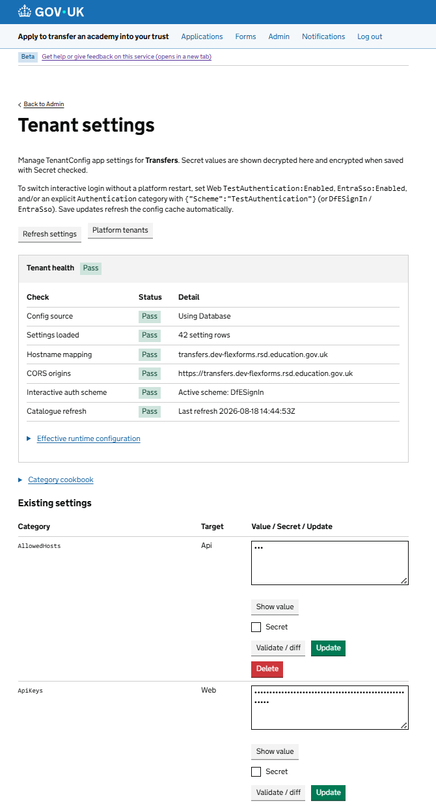

This is the **full configuration editor**: categories of JSON stored for Web, API, or Shared. Organisation settings and Event mappings write into the same store through friendlier screens. Use Tenant Settings when you need a category that has no dedicated page (for example [Email placeholder mappings](#13-email-placeholder-mappings)), or when you are asked to by the platform team.

Secret values are shown decrypted here and encrypted again when **Secret** is ticked on save.

Select **Refresh settings** after another admin has changed config, or if health looks stale.

### 14.1 Tenant health

A table of checks (Pass / Warn / Fail), including:

- Config source
- Settings loaded
- Hostname mapping
- CORS origins
- Interactive auth scheme
- Catalogue refresh

Plus a read-only snapshot of effective runtime configuration.

Treat a Fail as “ask the platform team” unless you just changed a setting and can **Validate / diff** it.

### 14.2 What a tenant Admin should usually change here

Prefer the dedicated screens first. If you must use this page, these categories match everyday product choices:

| Category | Target | What it controls | Better UI |
|----------|--------|------------------|-----------|
| **ApplicationTerminology** | Web | Singular / plural labels | Organisation settings |
| **NotificationBanner** | Web | Site-wide banner | Organisation settings |
| **Dashboard** | Web | Page size, filters, and dashboard display text | Organisation settings |
| **EventMappings** | Shared | Field mappings | Event mappings |
| **SchemaEvents** | Shared | Tenant event shapes | Event mappings |
| **EventTriggers** | Shared | Submit / upload publish bindings | Event mappings |
| **EmailPlaceholderMappings** | Shared | Extra GOV.UK Notify personalisation from form answers | This page (JSON) — see [Email placeholder mappings](#13-email-placeholder-mappings) |
| **Layout** | Web | Service name in the header, phase banner text and links | This page (JSON) — there is no separate form |
| **FileValidation** | Shared | Whether submit is blocked until a tenant function validates eligible files | This page (JSON) — see [14.6](#146-file-validation-tenant-function) |

**Layout** example (illustrative):

```json
{
  "ServiceName": "Local SEND Reform Plans",
  "PhaseBanner": {
    "PhaseText": "Beta",
    "Links": [
      { "Text": "Feedback", "Url": "/feedback" }
    ]
  }
}
```

`ServiceName` is the product name in the GOV.UK header and the browser title on the dashboard.

### 14.3 What to leave for SuperAdmin / platform

Do not edit these unless you have been briefed. They can lock people out or break the API.

| Category | Why it is sensitive |
|----------|---------------------|
| **Authentication** | Forces the login scheme (`TestAuthentication`, `DfESignIn`, `EntraSso`) |
| **TestAuthentication** | Dev/test login (often secret) |
| **EntraSso** / **DfESignIn** | Real SSO client IDs, secrets, endpoints |
| **Authorization** | API token behaviour |
| **ConnectionStrings** | Databases |
| **InternalServiceAuth** | Machine-to-machine keys |
| **AuthProviders** | API keys / mTLS. Needed for the file-validation callback — see [14.6](#146-file-validation-tenant-function) |
| **AllowedHosts** | Which hostnames the app accepts |
| **FeatureManagement** | Feature flags |
| **Email** / **EmailTemplates** | Notify API key and template GUIDs (platform-owned) |

The page also explains how SuperAdmins switch login without a platform restart (TestAuthentication / EntraSso / Authentication `Scheme`). Tenant Admins should not do this unprompted.

### 14.4 How to add or update a setting

Existing rows show **Category**, **Target**, JSON, **Secret**, then:

- **Show value** / **Hide value** (secrets)
- **Validate / diff** — checks the JSON before save
- **Update**
- **Delete** (cannot be undone)

**Add a setting:**

1. **Category** — use a name from the cookbook list on the page.
2. **Target** — `Shared`, `Api`, or `Web` (must match what that category supports).
3. **Settings JSON**
4. Tick **Secret (encrypt at rest)** if the payload contains passwords or keys.
5. **Validate / diff**, then **Add setting**.

**Export settings** / **Import settings** copy configuration between environments. Import skips secret placeholders. Use with care.

### 14.5 Audit log

**Audit log** on this page lists recent setting changes: When (UTC), Action, Category, Target, Actor.

### 14.6 File validation (tenant function)

This is **optional**. It is **not** virus scanning (that is always on — see [12.15](#1215-virus-scanning-always-on)).

Use it when your organisation has an Azure Function that checks uploaded files (for example Excel columns) and FlexForms should **block submit** until that check passes. A failed check **keeps** the file and marks it `Failed`. Malware still **deletes** the file.

You need **two** Tenant Settings rows, plus a `FileUploaded` event so the function is told about each upload.

#### Policy — `FileValidation` (Target **Shared**)

This category is not a secret. Add or update it on this page:

```json
{
  "DefaultMode": "Off",
  "Extensions": [ ".xlsx", ".xls" ],
  "Templates": {
    "aaaaaaaa-bbbb-cccc-dddd-eeeeeeeeeeee": "RequirePassed"
  }
}
```

Replace the GUID with your form’s template Id (Template Manager / Diagnostics).

| Mode | What applicants experience |
|------|----------------------------|
| `Off` | Ignore validation (default). Upload status stays `—`. |
| `FailOnInvalid` | Submit is blocked only after the function reports the file as invalid. |
| `RequirePassed` | Eligible files must be validated successfully. **Pending** also blocks submit. |

`Extensions` is optional. Empty or omitted means every upload is eligible when mode is not `Off`. With `[".xlsx"]`, photos stay `NotRequired` and never block submit.

`RequirePassed` can leave people stuck if the function is down. Prefer `FailOnInvalid` until the function is reliable.

#### API key — `AuthProviders` (Target **Api** or **Shared**)

The function must call:

`POST /v1/integrations/files/{fileId}/validation-result`

with headers `X-Tenant-ID` (your tenant GUID) and `X-Api-Key` (the **raw** secret). Signing in as Admin does **not** authorise this call.

FlexForms stores only a **hash** of the key. Treat the raw key like a password: give it to the function configuration, never paste it into Tenant Settings.

1. Generate a raw key in PowerShell:

```powershell
[guid]::NewGuid().ToString("N")
```

Copy that value into the function’s `X-Api-Key` setting.

2. Hash the **same** string (Windows PowerShell 5.1):

```powershell
[BitConverter]::ToString([Security.Cryptography.SHA256]::Create().ComputeHash([Text.Encoding]::UTF8.GetBytes("paste-raw-key-here"))).Replace("-","").ToLower()
```

3. On Tenant Settings, add or update **`AuthProviders`**. Tick **Secret (encrypt at rest)**. Target **Api** or **Shared**. JSON:

```json
{
  "Providers": [
    {
      "Name": "file-validation",
      "Kind": "ApiKey",
      "IsServicePrincipal": true,
      "KeyHash": "<paste-the-hash-from-step-2>",
      "Roles": ["FileValidation"]
    }
  ]
}
```

Leave `"IsServicePrincipal": true`. If it is missing or `false`, the function gets **403** even with a correct key.

4. **Validate / diff**, then **Add setting** or **Update**. Select **Refresh settings**.

Do **not** put this key in `InternalServiceAuth`. That category is for a different machine login.

If `AuthProviders` already has other providers, **add** this object to the `Providers` array — do not replace the whole list unless you intend to.

#### Tell the function about uploads

Under **Event mappings**, bind **File uploaded** to the event your function already consumes (same pattern as [12.12 Triggers](#1212-triggers--when-the-api-actually-publishes)). The callback must **not** publish onto FlexForms Service Bus; it only HTTP-posts the result.

#### What applicants see

| Surface | Behaviour |
|---------|-----------|
| Upload Status column | Validation pending / Validated / Validation failed |
| Preview submit | Disabled when any blocking file remains; names are listed |
| Banner and Notifications | Live update when the function posts a result |

Technical contract: [flexforms-api README — File validation](https://github.com/DFE-Digital/flexforms-api#file-validation-callback-tenant-integrations).

#### File validation checklist

- [ ] `FileValidation` Target **Shared**, mode set on the right template GUID
- [ ] `Extensions` matches the files you actually want checked
- [ ] Raw API key only in the function; **hash** in `AuthProviders`
- [ ] `IsServicePrincipal` is `true` and `Roles` includes `FileValidation`
- [ ] **Secret** ticked on `AuthProviders`; **Refresh settings** after save
- [ ] `FileUploaded` trigger publishes to the function
- [ ] Non-prod test: upload → pending → function → status + submit gate

---

## 15. Applications (admin list)

**Admin → Applications → View applications**  
Page: `/admin/applications`  
**Admin and SuperAdmin only** (not Caseworker).

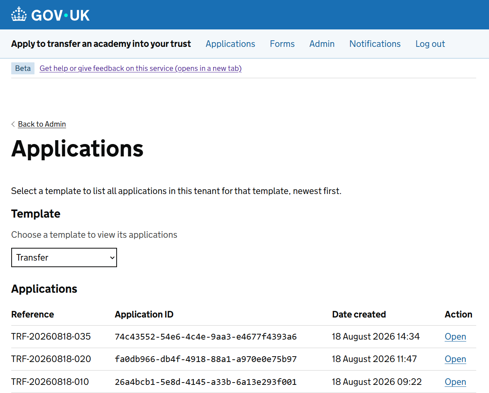

Choose a **Template** to list every application for that form in this tenant, newest first. Columns: Reference, Application ID, Date created, **Open** (new tab).

This is a catalogue for support. Caseworkers use the main **Applications** item in the header instead, which uses the same filters as the dashboard when filters are enabled.

---

## 16. What end users see

After you make a form live and grant access, a typical applicant gets:

| In the header | When |
|---------------|------|
| Service name (links to **Your {plural}**) | Always when signed in |
| **Forms** | Only if they have **more than one** live form they can access |
| **Notifications** | Always |
| **Log out** | Always |
| **Admin** | Not shown |
| **Applications** | Only with Caseworker-style `Application:Any:Read`, or Admin |

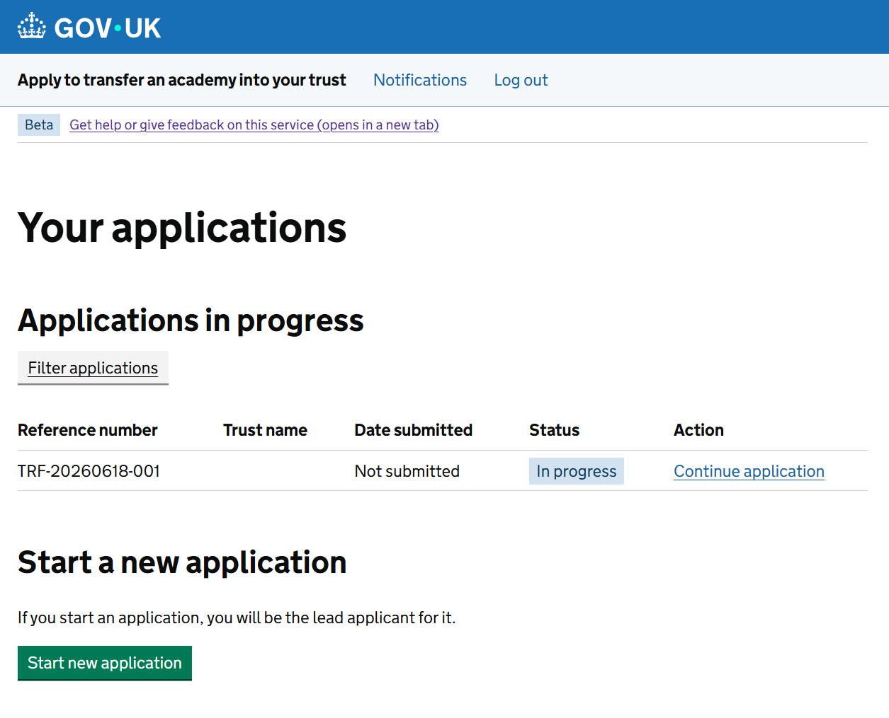

On the dashboard they can **Start a new {singular}**, continue in-progress work, and open submitted items. Status text follows your custom labels. Extra columns follow the template `dashboard` section.

If they have exactly one live form, they may skip **Choose a form** and go straight to the dashboard.

Previewing a not-live form as an admin shows: **THIS IS A PREVIEW OF {template name}**.

---

## 17. System tools and caches

**Admin hub → System → Clear All Sessions & Caches**

Use this after you publish a new template version if people still see the old questions or dashboard headings.

You may need to choose the form again afterwards (**Forms** or Admin → Open / Preview).

**Diagnostics** (when a template is selected) shows the active template name, id, version, cache key, and session tokens. Useful when raising a support ticket; not needed day to day.

Template Manager’s success message also offers **Clear all caches** after a new version.

---

## 18. Things only a SuperAdmin can do

You will **not** see these as a tenant Admin (by design):

| Screen | Purpose |
|--------|---------|
| **New tenant** (`/admin/duplicate-tenant`) | Clone a tenant, including a new service name |
| **Platform tenants** (`/admin/platform-tenants`) | List every tenant on the platform |
| Assigning the **Admin** role in User Manager | Only SuperAdmins get Admin in the role dropdown |

If you need a second tenant administrator, ask a SuperAdmin to assign the Admin role.

---

## 19. Troubleshooting

| What you see | What to try |
|--------------|-------------|
| No **Admin** link | You are not Admin, SuperAdmin, Template Manager, or User Manager. Ask a tenant Admin to grant a role. |
| Admin hub missing Users & Roles | You likely have Template Manager only. |
| Admin hub missing templates | You likely have User Manager only. |
| No **Contributor management** button | Expected unless you are Admin or SuperAdmin. `User:Any:Manage` is User Manager only. |
| “You do not have permission” on Platform tenants | Expected for tenant Admins. That button is SuperAdmin-only. |
| Saved a template version but users still see the old form | **Make live** if it is still Not live; **Clear All Sessions & Caches**; users may need to refresh or pick the form again. |
| Invalid JSON save with no explanation | You should now see an error summary and messages under JSON Schema. If not, hard-refresh the Template Manager page. |
| Banner or terminology not updating | Organisation settings: refresh the browser. Banner only shows when **Enabled** is ticked and **Message** is not empty. |
| User has a role but cannot open a form | User role needs **Forms** ticked, unless the role already grants application access (for example Caseworker). |
| Caseworker sees Applications in the nav but cannot list | They need `Application:Any:Read` (Create Caseworker role) and usually `ApplicationFiles:Any:Read` for files. They may also need template read for custom statuses. |
| Dashboard missing a custom column | Check `fieldId` matches the question, you have no more than three field columns, and you saved a new template version. Older applications can show blank cells. |
| Grant to all users succeeded but the banner showed zeros | Fixed in a recent release; counts should match people actually updated. |
| Submit succeeded but reporting never received a message | See [12.18 Troubleshooting event mappings](#1218-troubleshooting-event-mappings). Check triggers, mapping, Service Bus topic/subscription, and API logs. |
| Confirmation email missing academy name / custom text | See [13.12 Troubleshooting email placeholders](#1312-troubleshooting-email-placeholders). Check Notify `((placeholder))` spelling, `EmailPlaceholderMappings` (Target Shared), and form `fieldId`. |
| Upload stays “Validation pending” / submit stays blocked | See [14.6](#146-file-validation-tenant-function). Check `FileValidation` mode, `FileUploaded` trigger, function `X-Api-Key` (raw) vs `AuthProviders` `KeyHash`, `IsServicePrincipal: true`, and **Refresh settings**. |


---

## 20. Glossary

| Term | Plain meaning |
|------|----------------|
| **Application / reform plan / …** | One submitted or in-progress form. The on-screen word is configurable. |
| **Catalogue** | The templates that belong to this tenant (owned or mapped). |
| **Claim / grant** | A single permission assigned to a role or user. |
| **Contributor** | Someone invited onto a specific application, not necessarily a tenant user with their own forms. |
| **Live** | Visible to end users who have access. |
| **Schema / JSON schema** | The template document Template Manager saves as a version. |
| **Target (Shared / Api / Web)** | Which app a Tenant Settings category applies to. |
| **Tenant** | One organisation’s isolated environment. |
| **Template** | The form definition, including versions. |
| **Azure Service Bus (ASB)** | Cloud post office: FlexForms **sends** messages; other apps **read** them from a subscription. |
| **Event kind** | **Typed** (platform C# contract) or **Schema** (tenant JSON envelope). |
| **Event type** | Name on the message (`TransferApplicationSubmittedEvent`, `LsrpPlanSubmitted`, …). |
| **Field mapping** | JSON that copies form answers / metadata onto event properties. Does not publish until a trigger exists. |
| **mappingId** | Label shared by mapping JSON and the trigger. Runtime still loads by template + event type. |
| **Schema event** | Tenant-defined event: type name, `topicName`, JSON Schema. Published as `SchemaEventEnvelope`. |
| **Subscription** | Named inbox on a topic. Each consumer app needs its own. |
| **Topic** | Named pile of messages in Service Bus. Typed names come from CoreLibs; schema names are yours. |
| **Trigger** | `ApplicationSubmitted` or `FileUploaded` plus event kind, event type, and mapping id. |
| **Typed event** | A platform-defined Service Bus contract. Opposite of a tenant **schema event**. |
| **GOV.UK Notify** | Government email service. FlexForms sends a template ID plus personalisation; Notify builds the email body. |
| **Personalisation / placeholder** | A named value Notify inserts into `((Name))` in the template. Baseline keys are always sent; extras come from `EmailPlaceholderMappings`. |
| **EmailPlaceholderMappings** | TenantConfig category that maps form field Ids (and metadata) onto Notify personalisation keys. |
| **FileValidation** | Optional tenant-function check of uploads (not virus scanning). Modes: Off, FailOnInvalid, RequirePassed. |
| **AuthProviders** | TenantConfig for machine API keys / mTLS. File-validation stores a SHA-256 `KeyHash`, never the raw key. |

---

*This manual describes the Admin UI as implemented in FlexForms web. Platform SuperAdmin tools (new tenant, platform tenants) are mentioned only so tenant Admins know they are out of scope.*
